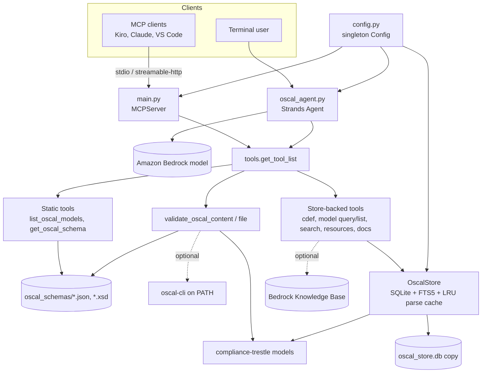
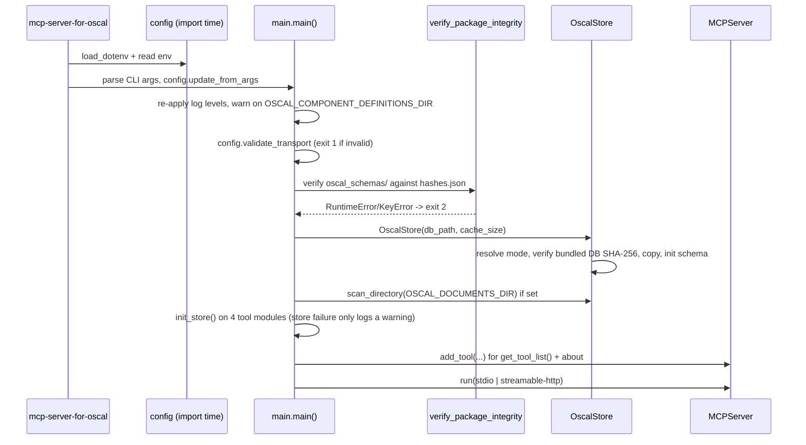
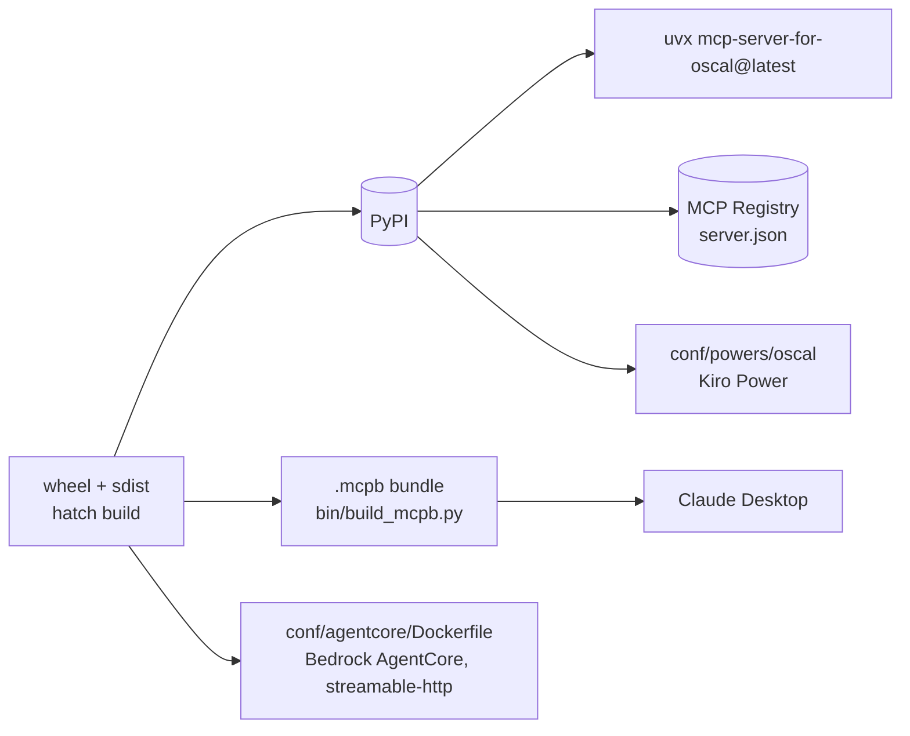

# Architecture

<!-- tags: architecture, design, runtime, startup, store, integrity -->

## Shape of the system

There are two front ends over one shared tool library and one data store:

- MCP server (`main.py`): an `MCPServer` from the MCP Python SDK v2 (`mcp.server.mcpserver`, formerly FastMCP). Uses stdio by default; `streamable-http` exists but has no authentication.
- OSCAL agent (`oscal_agent.py`): a Strands `Agent` on Amazon Bedrock, used from a CLI, that calls the same tool functions in-process.

Both get their tools from `tools.get_tool_list()`. The server also registers an `about` tool of its own.

## Key design decisions

| Decision | Where | Consequence for changes |
|---|---|---|
| Tools are plain functions decorated with Strands `@tool` and registered with `mcp.add_tool()` | `tools/*.py`, `main._setup_tools` | One function serves both the MCP server and the Strands agent. Docstrings are the tool descriptions for both, and `bin/build_mcpb.py` copies them into the `.mcpb` manifest |
| One canonical tool list | `tools/__init__.get_tool_list()` | A new tool is registered by adding it here. `about` is the exception: it is server-only and defined inside `main._setup_tools` |
| Module-level `OscalStore` singletons set by `init_store()` | `list_oscal_resources`, `query_component_definition`, `query_documentation`, `query_oscal_models` | `main._init_oscal_store()` must call `init_store` on each module. Tools raise `RuntimeError` (or return an error dict) when the store is unset. Tests reset the singletons through the autouse fixture `reset_oscal_store` |
| Pre-built SQLite DB shipped in the wheel | `oscal_store.db` + package `hashes.json`, built by `bin/build_oscal_db.py` | Bundled content (AWS cdefs, docs) is indexed at build time, not at startup. `data/` is not shipped |
| Database mode resolution | `OscalStore._resolve_db_path` | bundled: verified copy to a temp dir (default). persistent: `OSCAL_STORE_DB_PATH`; seeded from the bundled DB if the file is missing. ephemeral: empty temp DB if the bundled DB is missing or fails its integrity check |
| Lazy indexing | `documents.indexed` flag, `_ensure_indexed` | Scanning stores `raw_json` and metadata only. Child elements and FTS rows are extracted on first query (the build script indexes everything up front) |
| Parsing through trestle | `OscalStore._do_parse`, `TRESTLE_MODEL_MAP` | Parsed pydantic models are cached in an `lru_cache` sized by `OSCAL_STORE_CACHE_SIZE` |
| One SQLite connection per thread | `OscalStore._conn` (thread-local), WAL mode | MCP runs sync tools on worker threads; `close()` closes the connections from every thread |
| Startup integrity checks | `utils.verify_package_integrity(oscal_schemas)`; `OscalStore._verify_bundled_db` | Schema tampering exits with code 2. A DB hash mismatch only falls back to an ephemeral DB (logged as a warning) |
| Paginated responses | `utils.paginate`, `OscalStore._page_response` | `{items, total, offset, limit, hasMore}`; `limit` is 1–100 |
| Errors reported to the client and not fatal | `utils.try_notify_client_error` / `safe_log_mcp` | Broad `except` blocks are deliberate (ruff `BLE001` is ignored). MCP client logging is scheduled on the loop, or handed to it from worker threads with `anyio.from_thread` |

## Runtime startup sequence

## Deployment targets

