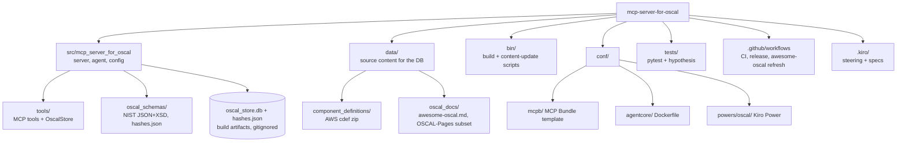

# Codebase Info

<!-- tags: overview, languages, layout, stack -->

## Identity

| Item | Value |
|---|---|
| Package | `mcp-server-for-oscal` (PyPI), import name `mcp_server_for_oscal` |
| Purpose | MCP server (plus a standalone Strands agent) that gives AI assistants tools for NIST OSCAL |
| License | Apache-2.0 |
| Python | `>=3.13`; CI matrix 3.13 and 3.14 on Linux, macOS, Windows; default dev env 3.14 (`mise.toml` pins 3.14, uv, hatch 1.18.1) |
| Versioning | `hatch-vcs` from git tags (`v*`); `_version.py` is generated and gitignored |
| Bundled OSCAL release | Read at runtime from the bundled schemas' `$id` (`get_bundled_oscal_version()`); source of truth is `CURRENT_RELEASE_VERSION` in `bin/update-oscal-schemas.sh` |

## Languages

| Language | Where | Analysis support |
|---|---|---|
| Python | `src/`, `tests/`, `bin/*.py`, `conf/mcpb/src/server.py` | Full (symbols, LSP) |
| Bash | `bin/*.sh` | Read manually; no symbol analysis |
| YAML | `.github/workflows/`, `.github/dependabot.yml` | Read manually |
| TOML / JSON | `pyproject.toml`, `server.json`, `conf/mcpb/manifest.json`, `hashes.json` manifests | Read manually |
| Markdown | Docs, `.kiro/steering`, `.kiro/specs`, bundled `data/oscal_docs` | Content, not code |
| Dockerfile | `conf/agentcore/Dockerfile` | Read manually |

No other languages exist in the repo, so there are no gaps from unsupported languages beyond the shell, YAML, and Dockerfile files listed above.

## Top-level layout

## Generated or ignored paths (not source)

| Path | What it is |
|---|---|
| `src/mcp_server_for_oscal/oscal_store.db`, `src/mcp_server_for_oscal/hashes.json` | Built by `bin/build_oscal_db.py`; shipped in the wheel as hatch `artifacts`; gitignored |
| `data/oscal_docs/OSCAL-Pages-main/` | Fetched by `bin/refresh-nist-docs.sh`; gitignored |
| `build/` | hatch build output (wheel, sdist, `.mcpb`) |
| `private/docs/` | Coverage, pytest junit XML, bandit reports |
| `MagicMock/` | Leaked SQLite files from tests that pass a `MagicMock` config as a DB path; gitignored |
| `_version.py` | hatch-vcs output |
