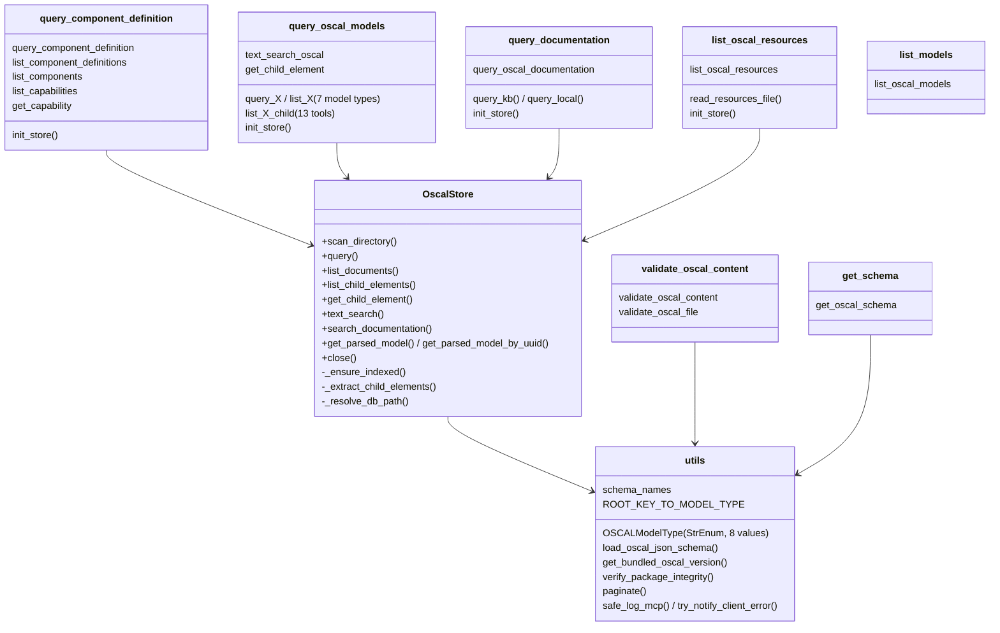

# Components

<!-- tags: components, modules, responsibilities, navigation -->

## Package `src/mcp_server_for_oscal`

| Module | Responsibility | Notes |
|---|---|---|
| `__main__.py` | `python -m mcp_server_for_oscal` → `main.main()` | |
| `main.py` | Creates the `MCPServer` with instructions, configures logging, parses CLI args, validates transport, checks schema integrity, calls `_init_oscal_store()`, `_setup_tools()`, `run()` | `mcp` and `meta` are module globals created at import time |
| `config.py` | `Config` reads env vars (after `load_dotenv()`); `update_from_args`; `validate_transport`. Singleton `config` | Imported by most modules; tests patch `<module>.config` |
| `oscal_agent.py` | `create_oscal_agent()` factory (BedrockModel, `ModelRetryStrategy`, `AgentObservabilityHook`), session managers (file/S3), conversation managers (sliding-window/summarizing/null), CLI `main()` with interactive and `--query` modes | Exit codes: 1 = agent creation failure, 2 = integrity failure |
| `oscal_schemas/` | NIST OSCAL JSON + XSD schemas (minified) + `hashes.json` | Checked at server startup; refresh with `hatch run update-oscal-schemas`, then `hatch run rehash` |
| `oscal_store.db`, `hashes.json` | Pre-built index of bundled content and its SHA-256 | Build artifacts; gitignored |

## Tools package `src/mcp_server_for_oscal/tools`

| Module | Responsibility | Gotchas |
|---|---|---|
| `__init__.py` | `get_tool_list()`: the canonical, ordered tool list (lazy imports) | `query_oscal_documentation` is always appended |
| `utils.py` | Shared enum, schema loading, OSCAL version, integrity check, pagination, MCP client logging | `verify_package_integrity` recurses into subdirectories and rejects files missing from the manifest |
| `oscal_store.py` | `OscalStore`: DB mode resolution and integrity, schema and migrations, scanning (`.json`, `.zip`, `.md`), oscal-bindings model validation on ingest, lazy child extraction (including nested catalog groups/controls), query/list/search with FTS5 and a LIKE fallback | By far the largest module. Dynamic SQL is limited to internal fragments (`# nosec B608`, ruff `S608` ignored for this file) |
| `query_component_definition.py` | Component Definition tools over `OscalStore`; `_Scope` resolves a cdef filter (exact UUID, or case-insensitive exact title); capability-first matching; only parses the cdefs it needs | Tests forbid legacy names and private store access (`TestLegacyStoreRemoved`, `TestPublicStoreApiOnly`) |
| `query_oscal_models.py` | Thin `@tool()` wrappers: `query_*`/`list_*` per model type, child-element listers, `text_search_oscal`, `get_child_element` | Component Definition has no `query_*`/`list_*` pair here; those tools live in `query_component_definition.py` |
| `query_documentation.py` | `query_oscal_documentation`: Bedrock KB `retrieve` with a fallback to local FTS over `documentation` rows | KB path only when `knowledge_base_id` has non-whitespace characters; otherwise local search with no AWS call |
| `list_oscal_resources.py` | Returns `awesome-oscal.md`, read from the store DB (`model_type='documentation'`) or, in dev, from `data/oscal_docs` | Reads `_store._conn` directly (`noqa: SLF001`) |
| `validate_oscal_content.py` | Four-level validation pipeline; `validate_oscal_file` reads a local path, `file://` URI, or (opt-in) an http(s) URI with `requests` | Uses the `regex` module for ECMA-262 `\p{..}` patterns in the schemas |
| `get_schema.py` | Returns a schema file by model name and type | |
| `list_models.py` | Static metadata for the 8 models (layer, status, descriptions) | |
| `README.md` | Human-facing tool reference | Partly stale, see review_notes |

## Build and maintenance scripts `bin/`

| Script | Invoked by | Does |
|---|---|---|
| `build_oscal_db.py` | `hatch run build-db` (part of `release`) | Rebuilds `oscal_store.db` from `data/component_definitions` and `data/oscal_docs`, indexes everything up front, writes the DB hash into the package `hashes.json` |
| `update_hashes.py` | `hatch run rehash` | Regenerates a directory's `hashes.json`; `rehash` also runs `git add` on the manifests |
| `build_mcpb.py` | `hatch run build-mcpb` | Stages `conf/mcpb`, injects version, wheel, and tool list, runs `uv lock`, `npx @anthropic-ai/mcpb@2 validate/pack` |
| `update-oscal-schemas.sh` | `hatch run update-oscal-schemas` | Downloads the NIST release `CURRENT_RELEASE_VERSION` and minifies the JSON with `jq` |
| `refresh-nist-docs.sh` | `release` | Downloads OSCAL-Pages `main` and extracts `src/content/learn/concepts/*` into `data/oscal_docs` |
| `update-aws-cdefs.sh` | manual | Rebuilds `data/component_definitions/aws-oscal-content-v<ver>.zip` |

## Configuration and packaging `conf/`, root files

| Path | Purpose |
|---|---|
| `conf/mcpb/` | MCP Bundle template: `manifest.json` (user_config → env), `pyproject.toml` (`WHEEL_FILENAME` placeholder), `src/server.py` (strips empty or `${user_config.*}` env values, then calls `main`) |
| `conf/agentcore/Dockerfile` | Installs the built wheel and runs streamable-http on `0.0.0.0` (stateless) for Bedrock AgentCore; built with `finch` |
| `conf/powers/oscal/` | Kiro Power (`POWER.md`, `mcp.json`) |
| `server.json` | MCP Registry metadata; the version fields are rewritten from the release tag in `release.yml`. `name` must match the `<!-- mcp-name: -->` comment at the top of README (tested) |
| `dotenv.example` | Template for `.env` |
| `requirements.txt` | Universal lock (uv compile) used as `UV_CONSTRAINT` for every hatch env |

## Tests `tests/`

| Area | Files |
|---|---|
| Shared fixtures | `conftest.py` (autouse `reset_oscal_store`, `fixture_store`, `many_capabilities_store`, markers), `fixture_store.py`, `fixtures/*.json` |
| Store | `tools/test_oscal_store.py` (largest; includes hypothesis property tests), `tools/test_nested_catalog_controls_*.py`, `tools/test_local_doc_search.py` |
| Tools | `tools/test_*.py`, one or more per tool module; `test_properties.py` (cdef properties) |
| Server/agent/config | `test_main.py`, `test_oscal_agent.py`, `test_config.py`, `test_tool_registry.py`, `test_integration.py` |
| Integrity | `test_file_integrity*.py` (`TestPackageManager` helper in `test_file_integrity_utils.py`) |
| Release metadata | `test_server_json.py`, `test_mcp_registry_properties.py`, `test_readme_verification.py`, `test_workflow_validation.py`, `test_build_oscal_db.py` |
