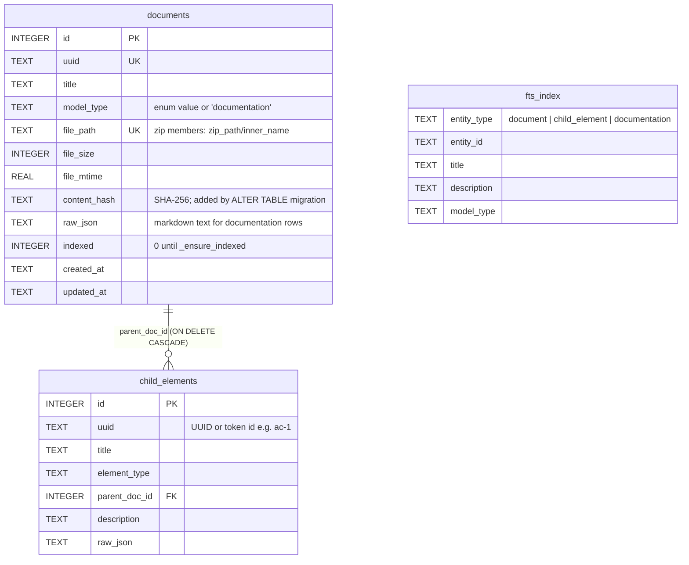

# Data Models

<!-- tags: data-models, sqlite-schema, oscal-types, response-shapes, manifests -->

## OSCAL model types

`utils.OSCALModelType` is a `StrEnum` whose values equal the JSON root keys. Model-type detection reads the first non-`$schema` root key through `ROOT_KEY_TO_MODEL_TYPE`.

| Enum | Value / root key | Schema file stem | oscal-bindings class | Child element types (`CHILD_ELEMENT_TYPES`) |
|---|---|---|---|---|
| CATALOG | `catalog` | `oscal_catalog_schema` | `Catalog` | `control`, `group` (recursive through groups) |
| PROFILE | `profile` | `oscal_profile_schema` | `Profile` | `import`, `modify` |
| COMPONENT_DEFINITION | `component-definition` | `oscal_component_schema` | `ComponentDefinition` | `component`, `capability` |
| SYSTEM_SECURITY_PLAN | `system-security-plan` | `oscal_ssp_schema` | `SystemSecurityPlan` | `control-implementation`, `system-component` |
| ASSESSMENT_PLAN | `assessment-plan` | `oscal_assessment-plan_schema` | `AssessmentPlan` | `task`, `activity` |
| ASSESSMENT_RESULTS | `assessment-results` | `oscal_assessment-results_schema` | `AssessmentResults` | `result`, `finding` |
| PLAN_OF_ACTION_AND_MILESTONES | `plan-of-action-and-milestones` | `oscal_poam_schema` | `PlanOfActionAndMilestones` | `poam-item` |
| MAPPING | `mapping-collection` | `oscal_mapping_schema` | `MappingCollection` | `mapping` |

`schema_names` also maps `"complete"` → `oscal_complete_schema`. The store also uses a pseudo model type, `documentation`, for markdown files; it is not in the enum.

All classes are imported from `oscal_bindings.models` (Pydantic v2, generated from the NIST JSON Schema). The enum-to-class map is defined once, as `utils.MODEL_MAP`, and shared by `OscalStore` and the validator. The store re-serializes parsed models with `model_dump_json(exclude_none=True, by_alias=True)`, so stored `raw_json` uses OSCAL's hyphenated keys.

## SQLite schema (`OscalStore._init_schema`)



- `UNIQUE(uuid, parent_doc_id)` on `child_elements`: token IDs such as `ac-1` can repeat across documents, which is why `get_child_element` can return an ambiguity error.
- Change detection compares SHA-256 content hashes (`_file_unchanged`). A NULL hash from before the migration forces a re-index.
- Markdown documents get a deterministic `uuid5(NAMESPACE_URL, file_path)`. The title comes from the first heading, or from the filename.
- `fts_index` is an FTS5 virtual table. On FTS syntax errors, search falls back to `LIKE`.

## Response shapes

| Shape | Keys | Producers |
|---|---|---|
| Page response | `items`, `total`, `offset`, `limit`, `hasMore` | `utils.paginate`, `OscalStore._page_response`; every list/query tool |
| Query item | `uuid`, `title`, `model_type`, `file_path`, `sizeInBytes`, `children[]` (`uuid`, `title`, `element_type`, `description`) | `OscalStore.query` |
| Child item | `id`, `title`, `element_type`, `description`, `parentDocumentTitle`, `parentDocumentUuid` (+ `raw_json` for `get_child_element`) | child listers, `get_child_element` |
| Search item | `entity_type`, `entity_id`, `title`, `description`, `model_type` | `text_search_oscal` |
| Validation result | `valid`, `model_type`, `levels{well_formedness, json_schema, model, oscal_cli}` each `{level, valid, errors[], warnings[], skipped, skip_reason}` | `validate_oscal_*` |
| cdef query | `components[]` (stored OSCAL JSON, hyphenated keys such as `control-implementations`), `total_count`, `query_type`, `component_definitions_searched`, `filtered_by`, plus pagination | `query_component_definition` |

Tests pin the exact key sets (for example `TestPageResponseFormat`, `TestPropertyBackwardCompatibleReturnFormat`), so a renamed key breaks them.

## Integrity manifests (`hashes.json`)

```json
{ "commit": "<git sha or empty>", "file_hashes": { "<filename>": "<sha256 hex>" } }
```

| Manifest | Generated by | Checked at runtime by |
|---|---|---|
| `src/mcp_server_for_oscal/oscal_schemas/hashes.json` | `hatch run rehash` | `verify_package_integrity` at server/agent start (fatal, exit 2) |
| `src/mcp_server_for_oscal/hashes.json` (`oscal_store.db` only) | `bin/build_oscal_db.py` | `OscalStore._verify_bundled_db` + post-copy check (non-fatal fallback to ephemeral) |
| `data/component_definitions/hashes.json`, `data/oscal_docs/hashes.json` | `hatch run rehash` | Nothing at runtime (`data/` is not shipped) |

`verify_package_integrity` matches manifest entries by file name, recurses into subdirectories, and rejects any file that is not in the manifest.

## Config model

`Config` is a plain class with typed attributes (no pydantic). Bools are parsed as `.lower() == "true"`, and ints with `int()`, so a malformed value raises at import time.
