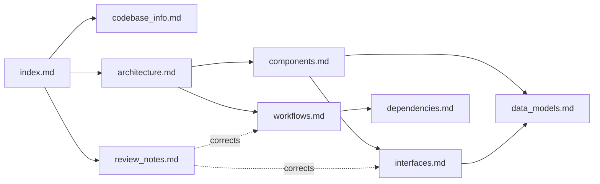

# Knowledge Base Index: mcp-server-for-oscal

<!-- tags: index, entry-point, navigation -->

## How AI assistants should use this directory

1. Load this file first. It is meant to be the only file you need in context to decide where to look next.
2. Use the routing table below to choose one or two detail files, and open only those.
3. Treat the source as authoritative. These docs were generated from a snapshot. If a doc disagrees with the code, trust the code, and check `review_notes.md`, which lists known drift and bugs.
4. Repo rules from `.kiro/steering/` apply to all work: run Python only through `hatch`; never prefix commands with `cd`; use compliance-trestle for OSCAL parsing and validation; use feature branches and never commit to `main` or push without approval.

## Project in one paragraph

`mcp-server-for-oscal` is a Python 3.11+ MCP server (MCP SDK v2 `MCPServer`, stdio by default) and a Strands/Bedrock agent. Both expose about 40 OSCAL tools from a single registry (`tools/__init__.get_tool_list()`). The tools cover schema lookup, 4-level validation, Component Definition navigation, query/list/search for all 8 OSCAL model types, community resources, and doc search. Content lives in a SQLite + FTS5 `OscalStore`. A pre-built `oscal_store.db` ships in the wheel and is verified by SHA-256 at startup, and users can add their own documents through `OSCAL_DOCUMENTS_DIR`. The project is built and tested with hatch, and is distributed through PyPI (`uvx`), the MCP Registry, an MCP Bundle (`.mcpb`), an AgentCore Dockerfile, and a Kiro Power.

## Table of contents

| File | Summary | Consult when |
|---|---|---|
| [codebase_info.md](codebase_info.md) | Package identity, Python and versioning, languages, top-level layout diagram, generated/ignored paths | Orienting; "where does X live"; "is this file source or a build artifact" |
| [architecture.md](architecture.md) | Server vs agent front ends, shared registry, store design decisions table, startup sequence, deployment targets | Design questions; adding a cross-cutting feature; startup or integrity behavior |
| [components.md](components.md) | Per-module responsibilities and gotchas for `src/`, `tools/`, `bin/`, `conf/`, and the tests layout | Finding the right file to change; understanding a module before editing |
| [interfaces.md](interfaces.md) | Every MCP tool grouped with key params, validation pipeline contract, CLI flags, env var groups, external services | Adding or changing a tool, flag, or env var; client integration questions |
| [data_models.md](data_models.md) | `OSCALModelType` table (root keys, schemas, trestle classes, child types), SQLite ER diagram, response key sets, `hashes.json` manifests | Store/SQL changes; response format questions; integrity manifest questions |
| [workflows.md](workflows.md) | Request flow through the store, doc-query routing, dev loop, CI/release pipeline, content-update procedures, git process | "How do I release/update schemas/rebuild the DB"; debugging tool request paths |
| [dependencies.md](dependencies.md) | Runtime and dev dependencies and their usage, undeclared transitive imports, toolchain, lock and Dependabot policy, upstream content sources | Adding or upgrading a dependency; build-environment problems |
| [review_notes.md](review_notes.md) | Consistency issues across docs and code, verified bugs, completeness gaps, recommendations | Before trusting README, DEVELOPING, or `tools/README.md`; choosing cleanup work |

## How the files relate

## Quick routing for common questions

| Question | Go to |
|---|---|
| Add a new MCP tool | components.md (tools table) → interfaces.md; register it in `get_tool_list()`; the docstring becomes the tool description |
| Support a new child element type | data_models.md (`CHILD_ELEMENT_TYPES`) → `OscalStore._extract_child_elements` |
| Why does startup exit with code 2? | architecture.md (startup sequence) → data_models.md (manifests) |
| Bundled content is stale or the DB hash is wrong | workflows.md (content updates; `build-db`, `rehash`) |
| Add an env var | interfaces.md (four places to update) |
| Release a version | workflows.md (build and release) |
| Test conventions and fixtures | components.md (tests) and the `reset_oscal_store` autouse fixture |
| Known bugs | review_notes.md |

## Example queries this index supports

- "Which file handles nested catalog groups?" → components.md → `oscal_store.py::_extract_controls_from_groups`.
- "What keys does `list_catalog_controls` return?" → data_models.md (child item).
- "Can the server fetch remote OSCAL files?" → interfaces.md (`OSCAL_ALLOW_REMOTE_URIS`).
- "What runs in CI on a PR?" → workflows.md (build and release).
