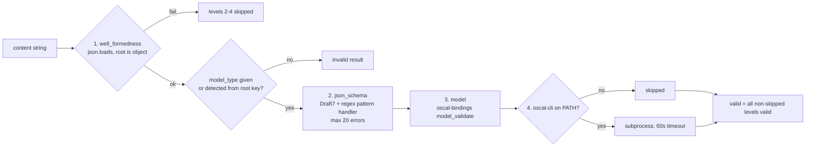
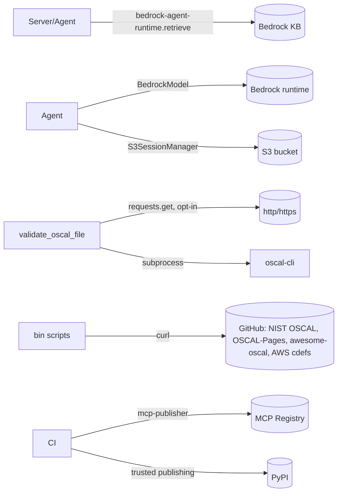

# Interfaces

<!-- tags: api, mcp-tools, cli, env-vars, integration-points -->

## MCP tools

Every tool except `about` comes from `tools.get_tool_list()`. `ctx: Context | None` is injected by MCP. Store-backed list and query tools take `offset` (≥0) and `limit` (1–100, default 10) and return a page response (see data_models.md).

| Group | Tools | Key params | Backing |
|---|---|---|---|
| Static | `list_oscal_models`, `get_oscal_schema` | `model_name` (default `complete`), `schema_type` `json`/`xsd` | `list_models.py`, `oscal_schemas/` |
| Resources/docs | `list_oscal_resources`, `query_oscal_documentation` | `query` | store `documentation` rows; Bedrock KB |
| Validation | `validate_oscal_content`, `validate_oscal_file` | `content` / `file_uri`, optional `model_type` | schemas, oscal-bindings models, oscal-cli |
| Component Definition | `query_component_definition`, `list_component_definitions`, `list_components`, `list_capabilities`, `get_capability` | `component_definition_filter`, `query_type` ∈ `all, by_uuid, by_title, by_type`, `query_value`, `uuid` | `OscalStore` + oscal-bindings `ComponentDefinition`; components/capabilities are returned as stored OSCAL JSON (hyphenated keys) |
| Per-model query/list | `query_{catalog, ssp, profile, assessment_plan, assessment_results, poam, mapping_collection}`, `list_{catalogs, ssps, profiles, assessment_plans, assessment_results, poams, mapping_collections}` | `query_type`, `query_value` | `OscalStore.query` / `list_documents` |
| Child elements | `list_catalog_controls`, `list_catalog_groups`, `list_ssp_control_implementations`, `list_ssp_system_components`, `list_profile_imports`, `list_profile_modify`, `list_assessment_plan_tasks`, `list_assessment_plan_activities`, `list_assessment_results_results`, `list_assessment_results_findings`, `list_poam_items`, `list_mapping_collection_mappings` | `parent_doc_uuid` | `OscalStore.list_child_elements` |
| Cross-cutting | `text_search_oscal`, `get_child_element` | `query_text`, `oscal_model_type`; `element_id`, `parent_doc_uuid` | FTS5; ambiguous token IDs return `{"error": "ambiguous_element_id", ...}` |
| Server-only | `about` | none | `{version, keywords, oscal-version}` |

### Validation pipeline contract

`validate_oscal_file` accepts local paths and `file://` URIs. http(s) is refused unless `OSCAL_ALLOW_REMOTE_URIS=true`, and then uses `OSCAL_REQUEST_TIMEOUT`.

## Command-line entry points (`[project.scripts]`)

| Command | Target | Flags |
|---|---|---|
| `mcp-server-for-oscal`, `mcp_server_for_oscal`, `server` | `main:main` | `--aws-profile`, `--log-level`, `--bedrock-model-id`, `--knowledge-base-id`, `--transport` |
| `oscal-agent`, `oscal_agent` | `oscal_agent:main` | the above plus `--query`, `--max-tokens`, `--session-id`, `--session-storage file\|s3`, `--session-dir`, `--session-s3-bucket`, `--session-s3-prefix`, `--conversation-manager sliding-window\|summarizing\|null` |

CLI values take precedence over env vars. `--aws-profile` is parsed by the server but is not passed to `update_from_args`, so the server only uses the `AWS_PROFILE` env var.

## Environment variables

All are read once by `Config.__init__` (the full table is in DEVELOPING.md; template in `dotenv.example`).

| Group | Variables |
|---|---|
| Server | `OSCAL_MCP_SERVER_NAME`, `OSCAL_MCP_TRANSPORT`, `OSCAL_MCP_HOST`, `OSCAL_MCP_STATELESS_HTTP`, `LOG_LEVEL` |
| Store | `OSCAL_DOCUMENTS_DIR` (relative paths resolve against the package dir), `OSCAL_STORE_DB_PATH`, `OSCAL_STORE_CACHE_SIZE` |
| Remote fetch | `OSCAL_ALLOW_REMOTE_URIS`, `OSCAL_REQUEST_TIMEOUT`, `OSCAL_MAX_URI_DEPTH` |
| AWS | `AWS_PROFILE`, `AWS_REGION`, `BEDROCK_MODEL_ID`, `OSCAL_KB_ID` |
| Agent | `OSCAL_AGENT_MAX_TOKENS`, `OSCAL_AGENT_MAX_RETRY_ATTEMPTS`, `OSCAL_AGENT_RETRY_INITIAL_DELAY`, `OSCAL_AGENT_RETRY_MAX_DELAY`, `OSCAL_AGENT_SESSION_*`, `OSCAL_AGENT_CONVERSATION_MANAGER` |
| Deprecated | `OSCAL_COMPONENT_DEFINITIONS_DIR` (no effect; a warning is logged once at startup) |

Env vars appear in four places: `config.py`, `dotenv.example`, `server.json` (registry, partial list checked by `test_server_json.py`), and `conf/mcpb/manifest.json` + `conf/mcpb/src/server.py` (`USER_CONFIG_ENV`).

## External integration points

