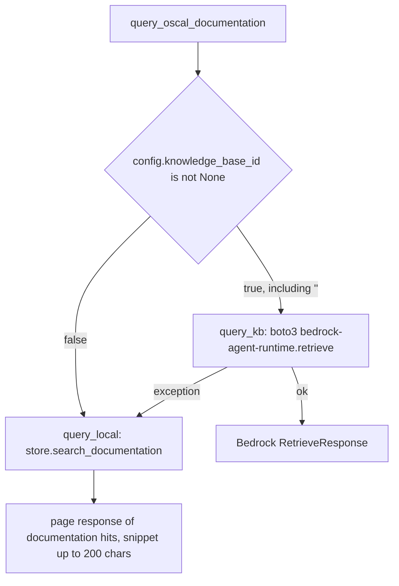
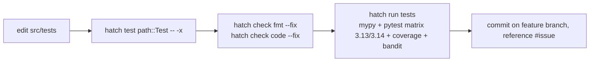
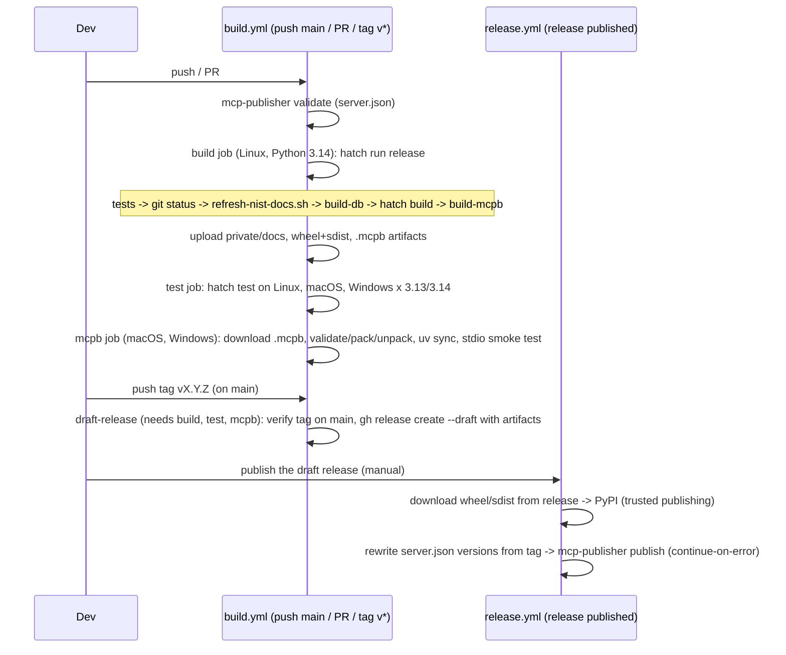

# Workflows

<!-- tags: workflows, build, release, ci, content-update, request-flow -->

## Tool request through the store

```mermaid
sequenceDiagram
    participant C as MCP client
    participant T as query_catalog (tool)
    participant S as OscalStore
    participant DB as SQLite (thread-local conn)
    participant P as oscal-bindings (LRU cached)
    C->>T: query_type=by_title, query_value="NIST 800-53"
    T->>S: query(model_type=catalog, ...)
    S->>DB: SELECT documents (NOCASE title; FTS fallback)
    S->>S: _ensure_indexed(doc_id) if indexed=0
    S->>P: parse raw_json (cached by doc_id + raw_json)
    S->>DB: INSERT child_elements + fts_index, set indexed=1
    S-->>T: page response
    T-->>C: JSON result
```

`query_component_definition` adds a scope step first: the filter must match a cdef UUID exactly, or its title case-insensitively. Fuzzy matches are rejected. Capabilities are matched before components, and only the candidate parent cdefs are parsed.

## Documentation query



Because the default `OSCAL_KB_ID` is `""`, the KB path always runs first and fails (logged as a warning) before falling back. See review_notes.

## Local development loop

The hatch steering file requires all Python to run through hatch.



- `hatch run tests` uses `--exitfirst --all --cover` and writes `private/docs/pytest.xml`.
- pytest flags go after `--`, because `-x`, `-p`, `-c`, and `-r` mean something else to `hatch test`.
- Dependencies: edit `pyproject.toml`, then `hatch run update` re-locks `requirements.txt` (universal, py3.13) and syncs.

## Build and release



Every CI build refreshes OSCAL-Pages docs from upstream `main` and rebuilds the DB, so the bundled documentation can change without a code change.

## Updating bundled content

```mermaid
flowchart TD
    subgraph Schemas
        A1[edit CURRENT_RELEASE_VERSION in bin/update-oscal-schemas.sh] --> A2[hatch run update-oscal-schemas]
        A2 --> A3[hatch run rehash]
        A3 --> A4[tests: TestBundledOscalVersion checks script version == schema $id]
    end
    subgraph AWS cdefs
        B1[edit CURRENT_RELEASE_VERSION in bin/update-aws-cdefs.sh] --> B2[run script: zip to data/component_definitions]
        B2 --> B3[hatch run rehash]
        B3 --> B4[hatch run build-db]
    end
    subgraph awesome-oscal
        C1[nightly update-awesome-oscal.yml] --> C2[hatch run update-awesome-oscal -> data/oscal_docs/awesome-oscal.md]
        C2 --> C3[PR if changed]
    end
```



The README OSCAL badge regex-reads `CURRENT_RELEASE_VERSION` from `bin/update-oscal-schemas.sh` on `main`.

## Project process (from `.kiro/steering/git-strategy.md`)

GitHub issue → feature branch → commits that reference `#<issue>` and say whether they were tested → run `hatch run tests` before committing → push and open a PR only with user approval. Never commit to `main` without approval. Spec-driven features live in `.kiro/specs/<feature>/` (requirements, design, tasks).
