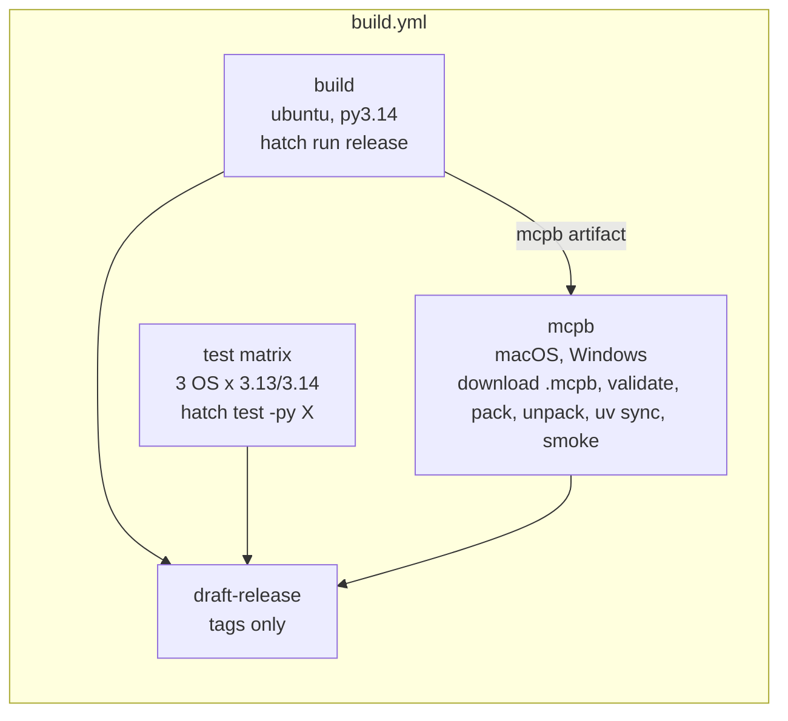

# Design Document: python-version-upgrade

## Overview

The change has three parts that land together:

1. **Version sites.** Move every Python version declaration to the 3.13 floor / 3.14 default, and add a guard test that keeps them in sync.
2. **Cross-platform CI.** Add a 6-cell test matrix (Linux, macOS, Windows × 3.13, 3.14) and fix what breaks on Windows.
3. **End-to-end checks.** Add a stdio smoke test that drives the real server process over JSON-RPC in both MCP protocol eras (modern `server/discover` as the primary check, the `initialize` handshake as a legacy-compat check), and an MCPB job that runs the same test against the shipped bundle on macOS and Windows.

Implementation branches from `main`.

Investigation findings that shape the design:

- **Windows checkout breaks integrity checks.** The repo has no `.gitattributes`. GitHub's Windows runners check out with `core.autocrlf=true`, so the text schemas in `oscal_schemas/` get CRLF endings. Their SHA-256 then no longer matches `hashes.json`, and `main()` exits with status 2. Every Windows test that verifies bundled content would fail, and so would the source-mode smoke test.
- **`mise.toml` is a Version_Site.** It is tracked and pins `python = "3.12"`. Investigation found it missing from the original site list; it has since been added to the requirements table, and this design moves it to `3.14`.
- **Ruff `py313` raises no findings today.** Both `hatch check code -- --target-version py313` and `hatch check fmt -- --target-version py313` exit 0. Requirement 3.3 stays as a contingency.
- **The installed SDK serves two protocol eras.** In mcp 2.1.1, `mcp_types/version.py` defines `MODERN_PROTOCOL_VERSIONS = ("2026-07-28",)`, served statelessly through a per-request `params._meta` envelope plus `server/discover`, and `HANDSHAKE_PROTOCOL_VERSIONS` up to `2025-11-25`, negotiated through `initialize`. The smoke test treats the modern era as the primary check and the handshake era as a legacy-compat check. Both versions come from `LATEST_MODERN_VERSION` and `LATEST_HANDSHAKE_VERSION`, so an SDK bump moves the test without edits.
- **The SDK locks the era per connection, so the smoke test launches once per era (Req 9.1).** `Server.run` drives `mcp/server/runner.py::serve_dual_era_loop`. The first JSON-RPC request decides the era once: a non-`initialize` request whose `params._meta` has `PROTOCOL_VERSION_META_KEY` opens a modern connection, and anything else opens a legacy one. After that, `initialize` on a modern connection gets `-32022 UNSUPPORTED_PROTOCOL_VERSION` ("connection is serving the 2026-07-28 protocol; the initialize handshake is not accepted"), and an enveloped request on a legacy connection gets `-32600 INVALID_REQUEST`. A stdio process is exactly one connection, so one launch can't serve both exchanges. I confirmed this with a live probe of our server (sequential requests over one process, both orders). The design therefore uses **two launches in the same test module, one per era**: `test_stdio_modern_discover_and_list_tools` and `test_stdio_handshake_initialize_and_list_tools`. Each launch uses the same `LaunchSpec`, environment, and assertions on the tool set. The requirements now match: Req 9.1 requires one subprocess launch per protocol era, and Req 9.9 triggers "WHEN a fresh Server subprocess starts for the Handshake_Exchange".
- **Modern envelope wire shape.** `mcp/client/session.py::send_discover` and `_make_modern_stamp` set three `_meta` keys on every modern request: `io.modelcontextprotocol/protocolVersion` (string version), `io.modelcontextprotocol/clientInfo` (`Implementation` dump, `{"name": str, "version": str}`), and `io.modelcontextprotocol/clientCapabilities` (`ClientCapabilities` dump; `{}` for a client with no callbacks). The server's `mcp/shared/inbound.py::classify_inbound_request` requires the version and capabilities keys and treats client info as optional. The smoke test sends all three, matching the SDK client. `_preconnect_stamp` only adjusts cancellation options and has no wire effect.
- **Modern and handshake results differ on the wire.** Probe results: `server/discover` returns `supportedVersions`, `capabilities`, `instructions`, `resultType: "complete"`, `ttlMs`, `cacheScope`, and `_meta["io.modelcontextprotocol/serverInfo"]`. Modern `tools/list` adds `resultType`, `ttlMs`, `cacheScope`, and the serverInfo stamp. Handshake `tools/list` has none of those (`ServerRunner._serialize` sieves results per version), so the `resultType` assertion applies to the modern era only. Capability flags also differ (`listChanged` is `true` in modern and `false` in handshake), so the test checks only that the `tools` key is present.
- **Our server needs no configuration for the modern era.** `main.py` calls `MCPServer.run(transport="stdio")` → `run_stdio_async` → lowlevel `Server.run` → `serve_dual_era_loop`. The default `server/discover` handler (`lowlevel/server.py::_handle_discover`) advertises `MODERN_PROTOCOL_VERSIONS`. A bare `server/discover` with no envelope routes to the legacy era and returns `-32601 Method not found`, so the envelope is mandatory even on the first request.
- **EOF drops in-flight responses.** When the probe pipelined several requests and then closed stdin, the server exited without answering the queued ones. The smoke test waits for each response before sending the next request and closes stdin only during cleanup.
- **The tool set doesn't depend on configuration.** `get_tool_list()` always includes `query_oscal_documentation` (see `test_tool_registry.py`), and `main._setup_tools()` adds `about`. So Expected_Tool_Set is `{fn.__name__ for fn in get_tool_list()} | {"about"}`, whatever `OSCAL_KB_ID` is set to.
- **An empty store is fine.** In source checkouts and the matrix job there is no bundled DB, so `OscalStore` falls back to ephemeral mode with a warning. Tool registration doesn't need data.

## Architecture

### CI job graph



- `build` and `test` start in parallel. `mcpb` has `needs: build` because it consumes the `mcpb` artifact.
- `draft-release` changes from `needs: build` to `needs: [build, test, mcpb]`. This keeps the Build_Job dependency (Req 7.4) and also gates releases on every platform.
- A failure in any job or matrix cell fails the workflow run (Req 8.4, 10.8). Both matrices set `fail-fast: false`.

### Decision: the MCPB job downloads the shipped artifact

The MCPB job downloads the `.mcpb` uploaded by `build` instead of rebuilding it on each OS.

- **It tests the bytes that ship.** `draft-release` attaches exactly this file.
- **Rebuilding per OS would be expensive and could test the wrong thing.** A rebuild needs `refresh-nist-docs.sh`, `build-db`, and `hatch build` on each runner. On Windows it would also pick up CRLF schemas if `.gitattributes` were ever wrong, so a "passing" bundle could differ from the real one.
- **The Req 10 steps still run on each OS:**

| Req | Step |
|---|---|
| 10.2 | `actions/download-artifact` → `dist/*.mcpb` |
| 10.3 | `mcpb unpack dist/*.mcpb staged/`, then `mcpb validate staged/manifest.json` |
| 10.4 | `mcpb pack staged/ repacked.mcpb` (checks that `pack` works on this OS against the shipped tree) |
| 10.5 | `mcpb unpack repacked.mcpb bundle/` → Unpacked_Bundle_Dir |
| 10.6 | `uv sync --frozen --directory bundle --python 3.13` |
| 10.7 | `OSCAL_SMOKE_BUNDLE_DIR=bundle hatch test -py 3.13 tests/test_integration_stdio_smoke.py` (the test resolves the relative path to absolute) |

The job syncs the bundle with Python 3.13, the Minimum_Version, because the matrix and build already cover 3.14. The bundle's `uv.lock` comes from `bin/build_mcpb.py` with `requires-python >=3.13`, so 3.13 is the floor most likely to expose lock or marker drift.

### Decision: keep `hatch run release` unchanged in `build`

`hatch run release` still runs `hatch run tests`, which means mypy, `hatch test --all` on 3.13 and 3.14, coverage, and bandit. That overlaps with the two Linux matrix cells. I'm accepting the overlap (a few minutes of runner time, in parallel, so no extra wall-clock time) because:

- `release` is the single pipeline that runs both locally and in CI. Splitting tests out of it in CI only would let the two drift apart.
- The `coverage` artifact (Req 7.3) comes from that run.
- The matrix job runs `hatch test` only, not `hatch run tests`. The `typing` and `bandito` scripts use `rm -rf`, `mkdir -p`, and `tee`, which don't work under Windows `cmd`.

A possible follow-up, not part of this change: drop `--all` from the `tests` script in CI with a `HATCH_TESTS_ARGS` override once the matrix has a track record.

### Workflow defaults

- `defaults.run.shell: bash` at workflow level, so the same step text runs on Windows (Git Bash) and POSIX. GitHub runs `shell: bash` as `bash --noprofile --norc -eo pipefail {0}`. On `ubuntu-latest` the only change for `build` is the added `pipefail`; the one piped step (`curl | tar` for `mcp-publisher`) should fail on a download error anyway. Hatch scripts (`typing`, `bandito`, `release`) run in hatch's own shell, so the step shell doesn't affect them.
- The `build` job installs both 3.13 and 3.14 with one `setup-python` step (`python-version: |` with `3.13` then `3.14`; the last entry is the default `python`). `hatch run release` runs `hatch test --all`, which needs a 3.13 interpreter. Today the 3.11 cell resolves without an explicit install (uv/hatch download), but installing it explicitly makes the job deterministic and avoids a download on every run.
- Every new job checks out with `fetch-depth: 0`, because `hatch test` installs the project and hatch-vcs derives the version from tags.
- The new jobs install hatch with the existing `pip install -U hatch` convention. Pinning hatch across all workflows is a separate change.
- `astral-sh/setup-uv@v6` and `actions/setup-node@v4` (Node 20) in `mcpb`, matching `build`.

## Components and Interfaces

### 1. Version_Site edits

| File | Change |
|---|---|
| `pyproject.toml` | `requires-python = ">=3.13"`; classifiers `3`, `3.13`, `3.14`; default env `python = "3.14"`; `target-version = "py313"`; `update` script `--python-version 3.13`; hatch-test matrix `["3.13", "3.14"]` |
| `requirements.txt` | regenerate with `hatch run update`; list direct-dependency pin changes in the commit and PR body (Req 4.4) |
| `conf/mcpb/pyproject.toml` | `requires-python = ">=3.13"` |
| `conf/mcpb/manifest.json` | `compatibility.runtimes.python = ">=3.13"`; `manifest_version` and `server.type` unchanged |
| `conf/agentcore/Dockerfile` | `FROM public.ecr.aws/docker/library/python:3.14-slim` |
| `.github/workflows/build.yml` | `build` setup-python `3.14`; new `test` and `mcpb` jobs; `draft-release.needs` extended |
| `.github/workflows/update-awesome-oscal.yml` | setup-python `3.14` |
| `mise.toml` | `python = "3.14"` (newly found site) |
| Docs_Set | text updates per Req 6.1–6.5 |
| `AGENTS.md` | line ~85 `(3.11 + 3.12)` → `(3.13 + 3.14)`; line ~112 "on Python 3.12" → "on Python 3.14", and add that the `test` job runs `hatch test` on Linux, macOS, and Windows × 3.13/3.14 and the `mcpb` job checks the bundle on macOS and Windows (Req 6.7) |
| `.agents/summary/codebase_info.md` | line ~12 → `` `>=3.13`; CI matrix 3.13 and 3.14 on Linux, macOS, Windows; default dev env 3.14 (`mise.toml` pins 3.14, uv, hatch 1.18.1) `` |
| `.agents/summary/dependencies.md` | line ~38 "pins python 3.14"; line ~48 `--python-version 3.13` |
| `.agents/summary/index.md` | line ~14 "Python 3.13+" |
| `.agents/summary/workflows.md` | line ~48 "pytest matrix 3.13/3.14"; line ~54 "(universal, py3.13)" |

A grep for bare `3.11`/`3.12` across `.agents/summary/*.md` finds hits only in the four files above. `review_notes.md` and the rest state no Python version today. The guard test scans the whole directory anyway, so a regenerated summary can't reintroduce a stale version.

Confirmed choices:

- **AgentCore image `python:3.14-slim`.** The Dockerfile `pip install`s a pure-Python wheel; all locked dependencies have 3.14 wheels or are pure Python (checked by the matrix install).
- **`update-awesome-oscal.yml` on 3.14.** It only runs `hatch run update-awesome-oscal` (curl).
- **60 s per-request timeout.** First startup imports boto3, strands, and pydantic models. On cold Windows runners that has taken around 10–20 s in comparable projects, so 60 s leaves headroom without hiding a hang.
- **`integration` marker.** The file name contains `test_integration`, so `conftest.pytest_collection_modifyitems` adds the marker automatically. The module also sets `pytestmark = pytest.mark.integration` so the marker is explicit.
- **`fail-fast: false`** on both matrices.

### 2. `.gitattributes` (new)

```gitattributes
# Default: normalize to LF in the repo and keep LF in working trees.
* text=auto eol=lf
# Bundled content is integrity-checked by SHA-256 at startup; it must be
# byte-identical to the committed blobs on every OS. These lines must stay
# after the `*` line: for each attribute, the last matching line wins.
src/mcp_server_for_oscal/oscal_schemas/** -text
data/** -text
tests/fixtures/** -text
```

`git ls-files --eol` shows no CRLF blobs in the index, so this needs no renormalization commit. Gitattributes apply last-match-wins per attribute, so the `* text=auto` line goes first and the `-text` lines after it. `eol` only takes effect when `text` is set or `auto`, so the inherited `eol=lf` is inert on the `-text` paths. Those paths keep exact bytes even if a file is ever committed with CRLF, and `eol=lf` stops Windows contributors from creating CRLF diffs elsewhere.

### 3. Windows test portability

Policy: fix product code and assertions that only *assume* POSIX. Skip a test only when it needs a facility Windows doesn't have, and name that facility in the reason (Req 8.5).

Known items:

| Location | Problem | Action |
|---|---|---|
| `tests/test_file_integrity.py` `test_permission_denied_*` and `test_handling_of_disk_io_errors_during_file_reading`, `test_permission_denied` on restricted files (4 sites using `chmod(0o000)`) | On Windows `chmod` only toggles the read-only flag, so the file stays readable and `pytest.raises` fails | `@pytest.mark.skipif(sys.platform == "win32", reason="requires POSIX file permission bits (chmod 0o000)")` |
| `test_file_integrity.py::test_exact_filename_matching_behavior` | already `skipif(sys.platform != "linux")` | keep |
| `test_file_integrity.py::test_filtering_of_symlinks` | already skips on `OSError` (symlink privilege) | keep |
| `tests/tools/test_get_schema.py` lines 232, 252 | `str(path).endswith("oscal_schemas/schema.json")` fails with `\` separators | assert `Path(call_args).parts[-2:] == ("oscal_schemas", "schema.json")` |
| `src/.../tools/utils.py` `open(schema_path)`, `open(...hashes.json)` | locale encoding (cp1252) on Windows; OSCAL JSON is UTF-8 | `encoding="utf-8"` |
| `src/.../tools/oscal_store.py` `BUNDLED_HASHES_PATH.read_text()`, `open(file_path)` at JSON load | same | `encoding="utf-8"` |
| `src/.../tools/validate_oscal_content.py` `open(lf)`; `NamedTemporaryFile(mode="w")` handed to `oscal-cli` | same | `encoding="utf-8"` on both |
| `src/.../tools/get_schema.py` `open_schema_file` | same (text mode for JSON/XSD) | `encoding="utf-8"` |
| `bin/update_hashes.py` writes `hashes.json` | same | `encoding="utf-8"` |
| Tests that keep an `OscalStore` open while a `TemporaryDirectory` is removed | Windows can't delete an open SQLite file (WinError 32) | close the store in `finally`. Audit `test_build_oscal_db.py` (lines ~323, ~371) and any similar sites flagged by the first Windows run |

Adding `encoding="utf-8"` is a real behavior fix: RFC 8259 makes JSON UTF-8, and 3.13/3.14 on Windows still default to the locale encoding. It isn't a test-only workaround. Expect the first Windows CI run to turn up more path-separator or file-locking issues; triage them with the same policy.

### 4. Stdio smoke test

File: `tests/test_integration_stdio_smoke.py`. Helpers live in the same module so the test stays self-contained.

#### Decision: raw JSON-RPC over `subprocess.Popen`, not the SDK client

- It checks the wire format a desktop host sees: newline-delimited JSON on stdout, nothing else on stdout, and `jsonrpc: "2.0"` result envelopes (Req 9.1). The SDK's `ClientSession` would parse and hide these, and it would pick the era for us (`mode='auto'` probing), which is the behavior under test.
- It's synchronous with no anyio task groups, and works the same on Windows. `select()` doesn't work on Windows pipes, so blocking reads run on daemon threads that feed `queue.Queue`, and `Queue.get(timeout=…)` provides the timeout.
- It owns process lifetime directly, which keeps Req 9.14 cleanup explicit.
- The envelope keys and versions are still imported from `mcp_types` (Req 9.2), so the raw requests track the SDK's wire vocabulary.

#### Decision: one launch per era

The SDK locks the era on the first request of a connection (see Overview), so the Modern_Exchange and the Handshake_Exchange can't share one process. Per Req 9.1, the design uses two launches of the same `LaunchSpec`, one per test function:

| Test | Era | Launch | Exchange |
|---|---|---|---|
| `test_stdio_modern_discover_and_list_tools` | modern (primary) | 1st | `server/discover` → `tools/list` (paged), every request enveloped at `LATEST_MODERN_VERSION` |
| `test_stdio_handshake_initialize_and_list_tools` | handshake (legacy compat) | 2nd | `initialize` at `LATEST_HANDSHAKE_VERSION` → `notifications/initialized` → `tools/list` (paged) |

Two functions instead of two phases in one function means a handshake failure doesn't hide the modern result, and the pytest report names the failing era. Cost: one extra server startup per run, about 2–5 s locally. Alternatives I rejected:

- Pinning an old protocol version only. The user rejected this.
- Overriding the era router in the server so one connection accepts both. That changes product behavior for a test, and no real host mixes eras on one connection.

The user confirmed this approach, and the requirements now match it: Req 9.1 requires one subprocess launch per protocol era, and Req 9.9 triggers when a fresh subprocess starts for the Handshake_Exchange.

#### Launch command resolution (Req 9.17)

```python
SMOKE_CMD_ENV = "OSCAL_SMOKE_SERVER_CMD"      # JSON array, used verbatim
SMOKE_BUNDLE_ENV = "OSCAL_SMOKE_BUNDLE_DIR"   # Unpacked_Bundle_Dir

@dataclass(frozen=True)
class LaunchSpec:
    argv: list[str]
    env_overrides: dict[str, str]   # merged over the sanitized base env
    mode: Literal["cmd", "bundle", "source"]
    bundle_manifest: dict | None = None

def resolve_launch(environ: Mapping[str, str]) -> LaunchSpec:
    """Pick the server launch command. Precedence: CMD > BUNDLE_DIR > console script.

    BUNDLE_DIR may be relative (CI passes ``bundle``). Resolve it with
    ``Path(value).resolve()`` against the pytest process cwd before calling
    bundle_launch, because the server runs with ``cwd=tmp_path``. Doing this in
    Python also avoids Git Bash ``$PWD`` values like ``/d/a/...`` on Windows.
    """

def bundle_launch(bundle_dir: Path, manifest: dict) -> LaunchSpec:
    """Build argv/env from manifest server.mcp_config the way an MCPB host does.

    ``bundle_dir`` must be absolute. Replace ``${__dirname}`` in command/args with str(bundle_dir). Leave
    ``${user_config.*}`` env values literal, so src/server.py's
    unset-placeholder stripping is exercised. Resolve argv[0] with shutil.which
    (uv -> uv.exe on Windows).
    """

def source_launch() -> LaunchSpec:
    """Console script from the running interpreter's scripts dir:
    Path(sysconfig.get_path("scripts")) / ("mcp-server-for-oscal" + (".exe" on win32)),
    falling back to shutil.which. The hatch-test env installs the project, so
    the script exists without calling hatch."""
```

Using the manifest's own `mcp_config` in bundle mode means the job runs the real host launch command, `uv run --frozen --directory <dir> src/server.py`, instead of a hand-written copy. It also avoids quoting Windows paths into a JSON env var.

#### Deterministic, offline environment (Req 9.19)

```python
def sanitized_env(base: Mapping[str, str]) -> dict[str, str]:
    """Copy base env; drop AWS_*, BEDROCK_*, VIRTUAL_ENV, and UV_CONSTRAINT
    (the last two leak in from the hatch-test env; a desktop host wouldn't set
    them, and `uv run` in bundle mode warns on a mismatched VIRTUAL_ENV); then force:
    OSCAL_KB_ID="", OSCAL_DOCUMENTS_DIR="", OSCAL_STORE_DB_PATH="",
    OSCAL_MCP_TRANSPORT="stdio", OSCAL_ALLOW_REMOTE_URIS="false",
    AWS_EC2_METADATA_DISABLED="true", LOG_LEVEL="INFO", PYTHONUNBUFFERED="1".
    """
```

Setting these keys explicitly to empty values stops a developer's repo `.env` from leaking in, because `load_dotenv()` doesn't override keys that already exist. `server/discover`, `initialize`, and `tools/list` make no network or AWS calls. The process also runs with `cwd=tmp_path`.

#### Modern envelope stamping (pure)

```python
from mcp_types import (
    CLIENT_CAPABILITIES_META_KEY,
    CLIENT_INFO_META_KEY,
    PROTOCOL_VERSION_META_KEY,
)
from mcp_types.version import LATEST_HANDSHAKE_VERSION, LATEST_MODERN_VERSION

Era = Literal["modern", "handshake"]
SMOKE_CLIENT_INFO = {"name": "oscal-smoke-test", "version": "0"}
SMOKE_CLIENT_CAPABILITIES: dict[str, Any] = {}   # what ClientCapabilities() dumps to

def stamp_modern_envelope(
    params: Mapping[str, Any] | None,
    *,
    version: str = LATEST_MODERN_VERSION,
    client_info: Mapping[str, Any] = SMOKE_CLIENT_INFO,
    capabilities: Mapping[str, Any] = SMOKE_CLIENT_CAPABILITIES,
) -> dict[str, Any]:
    """Return a new params dict carrying the modern per-request envelope.

    Mirrors mcp.client.session._make_modern_stamp: copy params (never mutate
    the caller's dict), copy any caller `_meta`, then set the three reserved
    keys, overwriting caller values for them. Non-reserved `_meta` keys (for
    example progressToken) and all other params (for example cursor) pass
    through unchanged.
    """
```

#### Server process wrapper

```python
class StdioServer:
    """Context manager around the server subprocess (one connection, one era)."""
    def __init__(self, spec: LaunchSpec, cwd: Path, timeout: float = 60.0): ...
    def __enter__(self) -> "StdioServer":
        # Popen(argv, stdin=PIPE, stdout=PIPE, stderr=PIPE, bufsize=0, env=..., cwd=...)
        # POSIX: start_new_session=True. Windows: creationflags=CREATE_NEW_PROCESS_GROUP.
        # Start daemon threads: stdout lines -> self._out (Queue[bytes|EOF]),
        # stderr chunks -> self._err (list[bytes], under a lock).
    def send(self, msg: dict) -> None:            # json.dumps(...).encode() + b"\n", flush
    def request(self, method: str, params: dict | None, *, era: Era) -> dict:
        # assigns id, send, wait_for(id, method, era), then check_result(...)
        # Returns response["result"]. Waits for each response before returning,
        # because stdin EOF drops in-flight responses.
    def modern_request(self, method: str, params: dict | None = None) -> dict:
        # request(method, stamp_modern_envelope(params), era="modern")
    def handshake_request(self, method: str, params: dict | None = None) -> dict:
        # request(method, params or {}, era="handshake")
    def notify(self, method: str, params: dict | None = None) -> None
    def wait_for(self, req_id: int, method: str, era: Era) -> dict:  # wraps read_response()
    def stderr_text(self) -> str:                 # utf-8, errors="replace"
    def __exit__(self, *exc) -> None:
        # 1. close stdin (server exits on EOF); wait(10)
        # 2. still alive: POSIX os.killpg(pgid, SIGTERM) then SIGKILL after 5 s;
        #    Windows `taskkill /T /F /PID <pid>` (kills the uv -> python tree)
        # 3. join reader threads (timeout 5 s); close stdout/stderr
        # Runs on pass and on failure (Req 9.14).
```

The wrapper doesn't enforce an era. A test that mixes `modern_request` and `handshake_request` on one instance gets the server's own `-32022` or `-32600` error back, reported through `check_result` with the era and method.

Killing the whole tree matters in bundle mode. `uv run` is the direct child and Python is a grandchild. Terminating only `uv` on Windows would orphan the server and keep the pipe handles open.

#### Pure response reader

```python
class SmokeTimeoutError(AssertionError): ...
class SmokeProtocolError(AssertionError): ...

def read_response(
    lines: Queue,               # items: bytes (one stdout line) or EOF sentinel
    req_id: int,
    timeout: float,
    stderr: Callable[[], str],
    clock: Callable[[], float] = time.monotonic,
) -> dict:
    """Return the JSON-RPC message whose id == req_id.

    - Strips the trailing line ending first. On Windows the server's stdout
      TextIOWrapper translates "\n" to "\r\n".
    - Skips server notifications (no "id") and responses with other ids.
    - Raises SmokeProtocolError if a stdout line isn't a JSON object (stdout must
      carry only JSON-RPC), or if the server sends EOF first. Includes stderr.
    - Raises SmokeTimeoutError after `timeout` seconds of total wait. The message
      includes stderr (Req 9.12).
    """
```

`wait_for` passes `method` and `era` into the timeout and EOF messages, so a hang reads like "modern tools/list (id 2): no response after 60.0 s".

#### Result checking and pagination (pure)

```python
class SmokeRpcError(AssertionError): ...

def check_result(response: dict, *, era: Era, method: str, stderr: str) -> dict:
    """Return response["result"], or raise.

    - jsonrpc != "2.0", or neither/both of result and error present
      -> SmokeProtocolError (era, method, raw response, stderr).
    - "error" present -> SmokeRpcError whose message contains the era, the
      method, the error object as JSON (code, message, data), and stderr
      (Req 9.13). Example first line:
      "handshake initialize returned JSON-RPC error -32022: connection is serving ..."
    """

def collect_tool_names(
    fetch_page: Callable[[str | None], dict],
    *,
    max_pages: int = 50,
) -> list[str]:
    """Follow nextCursor across tools/list pages and return names in order (Req 9.7).

    fetch_page(None) fetches the first page and fetch_page(cursor) each later
    one; the caller binds the era, so a modern page request is
    srv.modern_request("tools/list", {"cursor": c}) and a handshake one is
    srv.handshake_request("tools/list", {"cursor": c}). Stops when a page has
    no nextCursor (absent or null). Fails with SmokeProtocolError on a repeated
    cursor or after max_pages pages, so a server bug can't loop forever.
    """
```

The server returns all 40 tools in one page today, so pagination is exercised only through the pure helper's property test. The integration tests still run tool listing through `collect_tool_names`, so a future paging server is handled.

#### Test flow

```python
pytestmark = pytest.mark.integration

def expected_tool_set() -> set[str]:
    return {fn.__name__ for fn in get_tool_list()} | {"about"}

@pytest.fixture
def launch_spec() -> LaunchSpec:
    return resolve_launch(os.environ)   # same spec for both eras -> source or bundle mode for both

def assert_tool_names(names: list[str], spec: LaunchSpec) -> None:
    assert len(names) == len(set(names)), "duplicate tool names"
    assert set(names) == expected_tool_set()
    if spec.bundle_manifest is not None:
        assert set(names) == {t["name"] for t in spec.bundle_manifest["tools"]}

def test_stdio_modern_discover_and_list_tools(launch_spec, tmp_path):
    """Primary check: modern era (Req 9.2-9.8). First request is enveloped server/discover."""
    with StdioServer(launch_spec, cwd=tmp_path) as srv:
        discover = srv.modern_request("server/discover")
        assert LATEST_MODERN_VERSION in discover["supportedVersions"]
        assert "tools" in discover["capabilities"]
        def modern_page(cursor: str | None) -> dict:
            page = srv.modern_request("tools/list", {} if cursor is None else {"cursor": cursor})
            assert "resultType" in page, "modern tools/list result lacks resultType"   # Req 9.6
            return page
        names = collect_tool_names(modern_page)
        assert_tool_names(names, launch_spec)

def test_stdio_handshake_initialize_and_list_tools(launch_spec, tmp_path):
    """Legacy-compat check: initialize handshake (Req 9.9-9.11), fresh launch."""
    with StdioServer(launch_spec, cwd=tmp_path) as srv:
        init = srv.handshake_request("initialize", {
            "protocolVersion": LATEST_HANDSHAKE_VERSION,
            "capabilities": {},
            "clientInfo": SMOKE_CLIENT_INFO,
        })
        assert init["serverInfo"]["name"]
        assert "tools" in init["capabilities"]
        assert init["protocolVersion"] == LATEST_HANDSHAKE_VERSION
        srv.notify("notifications/initialized")
        names = collect_tool_names(
            lambda c: srv.handshake_request("tools/list", {} if c is None else {"cursor": c})
        )
        assert_tool_names(names, launch_spec)
```

Every modern page is checked for `resultType`. No handshake page is, because the SDK's per-version sieve removes it from handshake results.

Both tests use the same `launch_spec`, so `OSCAL_SMOKE_BUNDLE_DIR` puts both eras in bundle mode (Req 9.18), and the MCPB job's single `hatch test … tests/test_integration_stdio_smoke.py` step runs both. The bundle-mode check also confirms that the manifest `tools` list written by `bin/build_mcpb.py` matches what the server actually registers.

Unit tests for the helpers (`read_response`, `check_result`, `collect_tool_names`, `stamp_modern_envelope`, `resolve_launch`, `bundle_launch`, `sanitized_env`, and `StdioServer` cleanup) go in the same module and are marked as unit tests. They run in milliseconds and don't need a server.

### 5. Version-site guard test

File: `tests/test_python_version_sites.py`. It uses only the standard library (`tomllib`, `json`, `re`), because the hatch-test env has no PyYAML and so can't parse the workflows as YAML.

- `SUPPORTED = ("3.13", "3.14")`, `MINIMUM = "3.13"`, `DEFAULT = "3.14"`.
- Asserts the `pyproject.toml` fields (Req 1.1–1.3, 2.1, 2.2, 3.1, 4.1, 11.2).
- Asserts the `requirements.txt` header line contains `--universal` and `--python-version 3.13` (Req 4.2).
- Asserts the `conf/mcpb/*` fields, `manifest_version == "0.4"`, and `server.type == "uv"` (Req 5.2–5.4).
- Asserts the Dockerfile `FROM` line (Req 5.1) and `mise.toml`.
- Asserts every `python-version:` value in `.github/workflows/*.yml` is in SUPPORTED, by regex (Req 7.1, 7.2, 11.2).
- Stale-claim scan (Req 6.8). `STALE_SCAN_FILES` lists every text Version_Site, the Docs_Set, `AGENTS.md`, and `sorted(Path(".agents/summary").glob("*.md"))`. It excludes `requirements.txt`, whose package pins could contain `3.11`/`3.12` as a non-Python version; the header assertion above covers that file. Pattern: `STALE = re.compile(r"(?<![\d.])3\.1[12](?!\d)|\bpy31[12]\b")`. A bare-number match is stricter than a list of phrasings. The current hits include `(3.11 + 3.12)`, `3.11/3.12`, `py3.11`, `>=3.11`, and `python-version: "3.12"`, and a phrase list would miss some of them. A grep of all these files today finds only Python-version uses of these numbers. If a legitimate non-Python mention ever appears, it goes in an explicit `ALLOWED_STALE: set[tuple[str, str]]` of `(path, line substring)`. That set starts empty. The failure message lists `path:line: text` for every hit.
- A regex self-test pins the pattern. It must match each current stale line quoted in the requirements table, and must not match `0.3.12`, `3.13`, `3.14`, `13.12`, or `py313`.
- Required phrases (Req 6.1–6.7). A `REQUIRED_PHRASES: dict[str, list[str]]` maps each Docs_Set and Agent_Docs_Set file to the substrings it must contain after the edit. Examples: `AGENTS.md` → `"(3.13 + 3.14)"`, `"on Python 3.14"`; `codebase_info.md` → `">=3.13"`, `"3.13 and 3.14"`, `"pins 3.14"`; `dependencies.md` → `"pins python 3.14"`, `"--python-version 3.13"`; `index.md` → `"Python 3.13+"`; `workflows.md` → `"3.13/3.14"`, `"py3.13"`. The test is parametrized per file, so a failure names the file and the missing phrase.

## Data Models

There's no persistent data. The in-memory shapes:

- `LaunchSpec(argv: list[str], env_overrides: dict[str, str], mode, bundle_manifest: dict | None)`
- `Era = Literal["modern", "handshake"]`
- JSON-RPC messages: `dict` decoded from one UTF-8 stdout line.
- Modern request params on the wire (key names from `mcp_types`, values from the installed SDK):

  ```json
  {
    "cursor": "<optional>",
    "_meta": {
      "io.modelcontextprotocol/protocolVersion": "2026-07-28",
      "io.modelcontextprotocol/clientInfo": {"name": "oscal-smoke-test", "version": "0"},
      "io.modelcontextprotocol/clientCapabilities": {}
    }
  }
  ```

- Response fields the tests read. These are wire aliases of `mcp_types` models (`MCPModel` uses `alias_generator=to_camel`):
  - `DiscoverResult`: `supportedVersions` (`supported_versions`), `capabilities`, `resultType` (`result_type`, always serialized).
  - `ListToolsResult`: `tools[].name`, `nextCursor` (`next_cursor`, omitted when null); `resultType` is present only in the modern era.
  - `InitializeResult`: `protocolVersion`, `serverInfo.name`, `capabilities`.
- MCPB `manifest.json` `server.mcp_config`: `{"command": str, "args": list[str], "env": dict[str, str]}`.

## Error Handling

| Condition | Behavior |
|---|---|
| Server prints a non-JSON line to stdout | `SmokeProtocolError` with the offending line and stderr |
| Server exits before responding | `SmokeProtocolError("server closed stdout")`, with exit code and stderr |
| No response within 60 s | `SmokeTimeoutError` with era, method, id, elapsed time, and stderr |
| Integrity check fails at startup (e.g., CRLF schemas) | server exits 2; surfaces as the EOF error above, with the "tampered" log line in stderr |
| JSON-RPC `error` response | `SmokeRpcError` with era, method, the error object (code, message, data), and stderr (Req 9.13) |
| Modern request rejected for envelope shape (`-32602`, missing key) or version (`-32022`, `data.supported`) | same `SmokeRpcError`; the `data` field shows what the server accepts, which pinpoints SDK/test drift |
| Era mixed on one connection (`-32022` for `initialize` after modern, `-32600` for an enveloped request after handshake) | same `SmokeRpcError`; only reachable if a test breaks the one-era-per-launch rule |
| `server/discover` lacks `LATEST_MODERN_VERSION` in `supportedVersions` | assertion failure showing the advertised list (server and test SDK disagree, e.g. bundle locked to a different `mcp` than the test env) |
| Repeated `nextCursor` or more than 50 pages | `SmokeProtocolError` naming the era and the cursor |
| `OSCAL_SMOKE_SERVER_CMD` isn't a JSON string array | `pytest.fail` naming the env var |
| `OSCAL_SMOKE_BUNDLE_DIR` has no `manifest.json` | `pytest.fail` naming the path |
| Console script not found in source mode | `pytest.fail` explaining the hatch-test env must install the project |
| Cleanup can't kill the process | `__exit__` logs a warning and still closes pipes; the test result is kept |
| MCPB CLI or `uv sync` nonzero exit | the step fails, so the job and the workflow run fail (`shell: bash` runs with `-eo pipefail`) |

## Correctness Properties

*A property is a characteristic or behavior that should hold true across all valid executions of a system: a formal statement about what the system should do. Properties connect human-readable specifications to machine-verifiable correctness guarantees.*

Property reflection: most acceptance criteria are fixed configuration values or CI behavior, so example and integration tests cover them, not PBT. The protocol assertions themselves (Req 9.4, 9.6, 9.8–9.11) run against one real server and don't vary with input, so they're integration checks. Six pieces of new pure logic have meaningful input spaces:

- the response reader
- the RPC result check
- envelope stamping
- pagination
- bundle launch
- env sanitization

Merges and splits:

- "skips notifications" and "skips other ids" merged into Property 1.
- Timeout and EOF merged into Property 2.
- "stamping preserves params" and "stamping always sets the version key" merged into Property 5, because one generated `params` input checks both.
- Property 6 (RPC errors) stays separate from Property 2. It covers a different failure path (a well-formed error response, not a missing one), and Req 9.13 also requires the era and method in the report.
- Property 4 (env sanitization) stays separate because it has its own failure mode: secrets or KB configuration leaking from the host into the server.

### Property 1: Response reader returns exactly the matching response

*For any* sequence of stdout lines made of JSON-RPC notifications, responses with ids other than `n`, and exactly one response with id `n` at any position, each line optionally ending in `\r\n` instead of `\n`, `read_response(queue, n, …)` returns the message with id `n`, unchanged.

**Validates: Requirements 9.1, 9.3, 9.5, 9.9, 9.10**

### Property 2: Reader failures always carry stderr

*For any* stdout sequence with no response for id `n` (ending in EOF or nothing), and *for any* stderr text, `read_response` raises `SmokeProtocolError` (EOF) or `SmokeTimeoutError` (no EOF, with an injected clock past the timeout), and the exception message contains the stderr text.

**Validates: Requirements 9.12**

### Property 3: Bundle launch substitutes the directory faithfully

*For any* bundle directory path (including spaces, non-ASCII characters, and backslashes) and *for any* `mcp_config.args` list containing `${__dirname}` zero or more times, `bundle_launch(dir, manifest).argv[1:]` equals the args list with every `${__dirname}` replaced by `str(dir)`, has the same length (no shell splitting), and contains no remaining `${__dirname}`. `${user_config.*}` env values pass through unchanged.

**Validates: Requirements 9.17, 9.18, 10.7**

### Property 4: Sanitized environment is offline and deterministic

*For any* base environment mapping (arbitrary keys and values, including `AWS_*`, `BEDROCK_*`, `OSCAL_KB_ID`, and `OSCAL_DOCUMENTS_DIR` set to arbitrary strings), `sanitized_env(base)` contains no `AWS_*` key other than `AWS_EC2_METADATA_DISABLED`, no `BEDROCK_*`, `VIRTUAL_ENV`, or `UV_CONSTRAINT` key, `OSCAL_KB_ID == ""`, `OSCAL_DOCUMENTS_DIR == ""`, and `OSCAL_MCP_TRANSPORT == "stdio"`, and keeps every other key unchanged.

**Validates: Requirements 9.19**

### Property 5: Modern envelope stamping preserves params and always sets the envelope

*For any* JSON-like `params` mapping (or `None`), including a `cursor`, arbitrary other keys, and an optional caller `_meta` with arbitrary keys (some colliding with the reserved keys), and *for any* version string, `stamp_modern_envelope(params, version=v)` returns a new dict where:

- every non-`_meta` key equals its input value;
- `_meta[PROTOCOL_VERSION_META_KEY] == v`, `_meta[CLIENT_CAPABILITIES_META_KEY] == SMOKE_CLIENT_CAPABILITIES`, and `_meta[CLIENT_INFO_META_KEY] == SMOKE_CLIENT_INFO`;
- every non-reserved caller `_meta` key keeps its value;
- the input mapping (and its `_meta`) is unchanged afterward.

**Validates: Requirements 9.2, 9.3, 9.5, 9.7**

### Property 6: RPC error reports carry era, method, error, and stderr

*For any* era, method name, JSON-RPC error object (integer `code`, string `message`, optional arbitrary JSON `data`), and stderr text, `check_result({"jsonrpc": "2.0", "id": i, "error": e}, era=…, method=…, stderr=…)` raises `SmokeRpcError` whose message contains the era, the method, `str(e["code"])`, `e["message"]`, and the stderr text. *For any* well-formed result response, it returns `response["result"]` unchanged.

**Validates: Requirements 9.13**

### Property 7: Pagination collects every page in order

*For any* list of pages (each a list of tool-name strings) with distinct non-empty cursors linking them, where only the last page lacks `nextCursor`, `collect_tool_names(fetch)` returns the concatenation of all pages' names in order. It calls `fetch` once per page, with `None` first and then each page's `nextCursor`. *For any* page chain that repeats a cursor, it raises `SmokeProtocolError` instead of looping.

**Validates: Requirements 9.7, 9.8, 9.11**

## Testing Strategy

**Property tests** (Hypothesis, `@settings(max_examples=100)`, in `tests/test_integration_stdio_smoke.py`). Each one is tagged in its docstring: `Feature: python-version-upgrade, Property N: <title>`.

- P1 and P2 feed generated message lists into a `Queue` and use an injected fake clock, so no real waiting happens.
- P3 generates directory strings with `st.text(alphabet=st.characters(blacklist_categories=("Cs",), blacklist_characters="\x00"))` and args lists from `st.lists(st.sampled_from([...literals, "${__dirname}"]))`.
- P4 generates environments with `st.dictionaries`, and adds the sensitive keys explicitly.
- P5 generates `params` with `st.dictionaries(st.text(), json_values)` plus optional `cursor` and `_meta`. The `_meta` keys come from `st.one_of(st.text(), st.sampled_from([PROTOCOL_VERSION_META_KEY, CLIENT_INFO_META_KEY, CLIENT_CAPABILITIES_META_KEY, "progressToken"]))`. It deep-copies the input before the call so it can check non-mutation.
- P6 generates `code` with `st.integers()`, `message` with `st.text()`, `data` with recursive JSON values, and era from `st.sampled_from(["modern", "handshake"])`.
- P7 generates `st.lists(st.lists(st.text(min_size=1)), min_size=1)` pages and unique cursors (`st.uuids()`), and feeds them through a fake `fetch` that records its calls.

**Example and unit tests:**

- `StdioServer` cleanup: launch `sys.executable -c` with a script that ignores stdin EOF and sleeps. Inside the context, raise from the body. Then assert `proc.poll() is not None` and that the pipes are closed (Req 9.14). Run it on all OSes, with no skip.
- `resolve_launch` precedence: CMD over BUNDLE_DIR over source, plus the bad-JSON and missing-manifest failures.
- `stamp_modern_envelope` with defaults uses `LATEST_MODERN_VERSION` and the exact `mcp_types` key strings (Req 9.2). This pins the default argument, which P5 doesn't cover.
- The version-site guard test (component 5), including the stale-regex self-test and the Agent_Docs_Set phrase checks.
- The Windows portability fixes in component 3, through the existing tests running on the `windows-latest` cells.

**Integration and smoke checks:**

- `test_stdio_modern_discover_and_list_tools` and `test_stdio_handshake_initialize_and_list_tools` each launch their own server (one era per launch, per Req 9.1). They run in source mode on all 6 matrix cells and in bundle mode on the 2 MCPB cells (Req 9.1–9.19, 10.7).
- Bundle-mode caveat: the test reads protocol versions from the hatch-test env's `mcp` (pinned by `requirements.txt`). The bundle runs whatever `mcp` `bin/build_mcpb.py`'s `uv lock` resolved at build time. If the two drift, the discover assertion fails with the advertised `supportedVersions` in the message. That points at the version skew, and the skew is worth catching before release.
- Gotcha for local probing: `hatch run python -c '…'` treats `{…}` in the command as hatch context fields, so dict literals fail with "Unknown context field". Put ad-hoc probes in a file under the gitignored `private/` directory and run `hatch run python private/<file>.py`.
- `hatch run tests`, `hatch run typing`, `hatch check fmt`, and `hatch check code` pass locally on 3.14 and in `build` (Req 2.3, 2.4, 3.2).
- `hatch build`, then read `METADATA` from the wheel and check for `Requires-Python: >=3.13` (Req 1.4). This is a manual check during the tasks; `build` produces the wheel.
- `mcpb validate` in `build` (via `build-mcpb`) and in `mcpb` (Req 5.5, 10.3).

**What can't be verified locally:** the dev machine is macOS, so the Windows and Linux behavior (CRLF handling, file locking, `taskkill` cleanup, `uv` resolution on Windows) is only verified by the first CI run on a pushed branch. Pushing requires explicit user approval.
