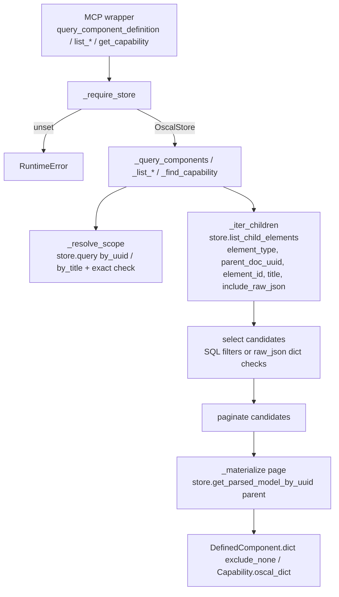

# Design Document: remove-legacy-cdef-store

## Overview

`query_component_definition.py` carries two implementations: the legacy in-memory `ComponentDefinitionStore` (empty at runtime) and a partial `OscalStore` delegation layer that still falls back to the legacy store for component-level queries, reads the wrong key (`"uuid"` instead of `"id"`) from `list_child_elements`, caps capability scans at 100 items, and reaches into `OscalStore._conn`.

This design removes the legacy store entirely and makes `OscalStore` the only backend. The core idea:

1. **Find candidates in SQL.** Every component and capability is already a row in `child_elements` (the bundled DB is fully pre-indexed by `bin/build_oscal_db.py`). Candidate discovery uses `list_child_elements` with new exact-match filters (`element_id`, `title`) and an optional `include_raw_json` projection. No Trestle parsing happens during discovery.
2. **Materialize from the parent.** Each returned Component/Capability is produced by parsing its parent Component Definition through a new public `OscalStore.get_parsed_model_by_uuid()` (LRU-cached) and picking the object by UUID. Only the parents of the *returned page* are parsed, so parsing is bounded by `limit` (≤ 100), never by the 230 bundled documents.
3. **One algorithm, two scopes.** Filtered and unfiltered queries run the same code; the filter only sets `parent_doc_uuid` on the candidate queries.
4. **Deprecate the orphaned setting.** With the legacy store gone, `OSCAL_COMPONENT_DEFINITIONS_DIR` has no reader. `Config` keeps the attribute for backward compatibility, and `main.main()` logs one deprecation warning per server start when the variable is present (Requirement 8).

## Architecture



### Which paths scan, and what they parse

| Query | Scope | Candidate discovery (SQL, no parse) | Trestle parses |
|---|---|---|---|
| `all` | filtered | children of 1 doc | 1 cdef (matched) |
| `all` | all | all component rows (summary columns) | parents of page items (≤ `limit`) |
| `by_uuid` | either | `element_id = ?` (indexed `idx_child_uuid`) | parent of the first hit (≤ 1) |
| `by_title` (title hit) | either | `title = ? COLLATE NOCASE` (indexed `idx_child_title`) | parent of the first hit (≤ 1) |
| `by_title` (prop fallback) | filtered | children of 1 doc, with `raw_json` | 1 cdef |
| `by_title` (prop fallback) | all | **full scan** of component `raw_json` (`json.loads`, dict check) | parent of the first hit (≤ 1) |
| `by_type` | filtered | children of 1 doc, with `raw_json` | 1 cdef |
| `by_type` | all | **full scan** of component `raw_json` (`json.loads`, dict check) | parents of page items (≤ `limit`) |
| capability lookup | either | `element_type='capability'` + `element_id`/`title` | parent of the first hit (≤ 1) |

Only two paths scan every component: unfiltered prop-value fallback and unfiltered `by_type`. They are unavoidable because neither the property values nor `type` are columns in `child_elements`. The scan reads already-serialized JSON and does plain dict checks; it never Trestle-parses a whole Component Definition.

On a store that is not pre-indexed (e.g. ephemeral store built from `OSCAL_DOCUMENTS_DIR`), the first unscoped `list_child_elements` call indexes every unindexed document once. That is existing `OscalStore` behaviour, persisted in SQLite, and unchanged by this design.

## Key Design Decisions

### Materialize via parent parse, not `DefinedComponent.parse_obj(raw_json)`

`child_elements.raw_json` holds each child serialized with `json(exclude_none=True, by_alias=True)`, so `DefinedComponent.parse_obj(json.loads(raw_json))` is a viable alternative. We use it only for *selection* (dict-level `type`/`props` checks), and materialize from the parent model because:

- **One materialization path.** Filtered and unfiltered results, and component and capability results, all come from `get_parsed_model_by_uuid()`. Output is identical regardless of how the candidate was found.
- **`raw_json` is nullable.** `_child_dict` stores `None` if serialization failed at index time; the parent document is always present.
- **Bounded cost.** Parsing is limited to page parents (≤ `limit`), and the LRU cache (`OSCAL_STORE_CACHE_SIZE`, default 100) absorbs repeats. A parse-every-cdef approach would scan 230 documents through a 100-entry LRU, evicting everything on each full scan.

### Why not parse all in-scope cdefs for `by_type` / prop fallback

Unfiltered, that is 230 parses per query and LRU thrash (see above). Scanning `raw_json` gives the same answer with `json.loads` only, and lets pagination decide what to materialize.

### Filters on `list_child_elements` instead of `get_child_element`

`get_child_element(element_id)` doesn't filter by `element_type` and returns an ambiguity error dict when a UUID occurs in several documents. Adding keyword-only `element_id` and `title` filters to `list_child_elements` handles type, parent scoping, multiple matches, and ordering in one query, and fixes the 100-item capability cap without any scan.

### Exact CDef_Filter title match

`OscalStore.query(by_title)` falls back to FTS (fuzzy) when there is no exact match. The current delegation code accepts the FTS hit, so a filter like `"AWS"` could silently match an arbitrary document. The new `_resolve_scope` accepts a title match only when `item["title"].lower() == filter.lower()`, matching the legacy semantics required by 4.5.

### Ordering

Candidates follow `list_child_elements` ordering: `title COLLATE NOCASE, uuid`. "First" in `by_uuid`, `by_title`, and the prop fallback means first in that order. The legacy store used document insertion order with last-write-wins dicts. Neither order was specified or documented, so this is not a contract change.

## Components and Interfaces

### OscalStore changes (`tools/oscal_store.py`)

```python
def get_parsed_model_by_uuid(self, doc_uuid: str) -> object | None:
    """Return the parsed Trestle model for the document with *doc_uuid*.

    Uses the same LRU cache as get_parsed_model(). Returns None when
    *doc_uuid* is empty or matches no document.
    """
    if not doc_uuid:
        return None
    row = self._conn.execute(
        "SELECT id FROM documents WHERE uuid = ?", (doc_uuid,)
    ).fetchone()
    return None if row is None else self.get_parsed_model(row["id"])


def list_child_elements(
    self,
    ctx: object | None = None,
    parent_doc_uuid: str | None = None,
    element_type: str | None = None,
    offset: int = 0,
    limit: int = 10,
    *,
    element_id: str | None = None,      # new: WHERE ce.uuid = ?
    title: str | None = None,           # new: WHERE ce.title = ? COLLATE NOCASE
    include_raw_json: bool = False,     # new: adds "raw_json" to each item
) -> dict: ...
```

The new parameters are keyword-only with defaults that preserve current behaviour, so the 13 `query_oscal_models` wrappers are untouched. Filters use bound parameters; the existing `# nosec B608` f-string only interpolates the fixed clause list.

### CDef_Tools module layout (`tools/query_component_definition.py`)

Removed: `ComponentDefinitionStore`, `_store`, `_load_component_definitions_from_directory`, the import-time `_store.load_from_directory()` call, all `else` fallbacks in wrappers, `_paginate_component_response`'s legacy caller, `_oscal_store_find_capability`'s `_conn` access, and the now-unused imports (`json` if unused, `zipfile`, `Path`, `urlparse`, `requests`, `cast`, `config`). `ruff` (F401) enforces 1.4.

```python
_oscal_store: OscalStore | None = None

def init_store(store: OscalStore) -> None: ...          # unchanged signature

def _require_store() -> OscalStore:
    if _oscal_store is None:
        raise RuntimeError(
            "OscalStore is not initialised; call init_store() before using "
            "Component Definition tools"
        )
    return _oscal_store
```

Each `@tool()` wrapper keeps its signature and docstring, calls `store = _require_store()`, and passes `store` explicitly to a private helper. Helpers take `store: OscalStore` as their first argument, which removes the `# pragma: no cover` guards and makes them trivially testable.

| Wrapper | Helper |
|---|---|
| `query_component_definition` | `_query_component_definition(store, ctx, filter, query_type, query_value, offset, limit)` |
| `list_component_definitions` | `_list_component_definitions(store, ctx, offset, limit)` (logic unchanged) |
| `list_components` | `_list_components(store, ctx, offset, limit)` |
| `list_capabilities` | `_list_capabilities(store, ctx, offset, limit)` |
| `get_capability` | `_get_capability(store, uuid)` |

### Internal helpers

```python
@dataclass(frozen=True)
class _Scope:
    cdef_uuid: str | None     # None = every Component Definition
    searched: int             # component_definitions_searched


def _resolve_scope(
    store: OscalStore, ctx: Context | None, cdef_filter: str | None, total_cdefs: int,
) -> _Scope | None:
    """None means a filter was given and matched nothing (Req 4.5)."""
    if not cdef_filter:
        return _Scope(None, total_cdefs)
    hit = store.query(ctx, OSCALModelType.COMPONENT_DEFINITION, "by_uuid", cdef_filter, 0, 1)
    if hit["total"] == 0:
        hit = store.query(ctx, OSCALModelType.COMPONENT_DEFINITION, "by_title", cdef_filter, 0, 1)
        if not hit["items"] or hit["items"][0]["title"].lower() != cdef_filter.lower():
            safe_log_mcp(..., ctx, "info")   # existing guidance message
            return None
    return _Scope(hit["items"][0]["uuid"], 1)


_CHILD_PAGE = 500

def _iter_children(store: OscalStore, element_type: str, scope: _Scope, **filters: Any) -> Iterator[dict]:
    """Yield every matching child summary, paging list_child_elements."""
    offset = 0
    while True:
        page = store.list_child_elements(
            element_type=element_type, parent_doc_uuid=scope.cdef_uuid,
            offset=offset, limit=_CHILD_PAGE, **filters,
        )
        yield from page["items"]
        if not page["hasMore"]:
            return
        offset += _CHILD_PAGE


def _raw(store: OscalStore, child: dict) -> dict:
    """Child JSON for dict-level checks; materializes from parent if raw_json is None."""


def _component_type(raw: dict) -> str: return str(raw.get("type", ""))
def _has_prop_value(raw: dict, value: str) -> bool:
    return any(p.get("value") == value for p in raw.get("props") or [])


def _select_component_candidates(
    store: OscalStore, scope: _Scope, query_type: str, value: str | None,
) -> list[dict]:
    if query_type == "all":
        return list(_iter_children(store, "component", scope))
    if query_type == "by_uuid":
        return _first(_iter_children(store, "component", scope, element_id=value))
    if query_type == "by_title":
        hit = _first(_iter_children(store, "component", scope, title=value))
        if hit:
            return hit
        return _first(
            c for c in _iter_children(store, "component", scope, include_raw_json=True)
            if _has_prop_value(_raw(store, c), value)
        )
    if query_type == "by_type":
        return [
            c for c in _iter_children(store, "component", scope, include_raw_json=True)
            if _component_type(_raw(store, c)) == value
        ]
    raise ValueError(f"Invalid query_type: {query_type}")


def _materialize_components(store: OscalStore, page: list[dict]) -> list[dict]:
    """Parse each distinct parent once; return DefinedComponent.dict(exclude_none=True)."""
    by_parent: dict[str, dict[str, DefinedComponent]] = {}
    out: list[dict] = []
    for cand in page:
        parent = cand["parentDocumentUuid"]
        if parent not in by_parent:
            model = store.get_parsed_model_by_uuid(parent)
            comps = model.components if isinstance(model, ComponentDefinition) else None
            by_parent[parent] = {str(c.uuid): c for c in comps or []}
        comp = by_parent[parent].get(cand["id"])
        if comp is None:
            logger.warning("Component %s missing from parent %s", cand["id"], parent)
            continue
        out.append(comp.dict(exclude_none=True))
    return out


def _find_capability(
    store: OscalStore, scope: _Scope, query_type: str, value: str,
) -> Capability | None:
    key = {"element_id": value} if query_type == "by_uuid" else {"title": value}
    hit = _first(_iter_children(store, "capability", scope, **key))
    if not hit:
        return None
    model = store.get_parsed_model_by_uuid(hit[0]["parentDocumentUuid"])
    caps = model.capabilities if isinstance(model, ComponentDefinition) else None
    return next((c for c in caps or [] if str(c.uuid) == hit[0]["id"]), None)
```

`_first(it)` returns `[next(it)]` or `[]`; generators stop at the first hit, so the `by_uuid`/`by_title` paths issue a single `LIMIT 500` query.

### `_query_component_definition` flow

1. Strip `query_value` (4.6). If `query_type` needs a value and it is empty, notify and raise `ValueError` (4.3).
2. `total_cdefs = store.list_documents(ctx, COMPONENT_DEFINITION, 0, 1)["total"]`; if 0, notify and raise `ValueError("No Component Definitions loaded")` (4.4).
3. `scope = _resolve_scope(...)`; if `None`, return the empty Component_Query_Response with `component_definitions_searched = 0` and pagination metadata from `paginate([], offset, limit)` (4.5).
4. For `by_uuid`/`by_title`, call `_find_capability`. On a hit, return the Capability_Query_Response: `capability = cap.oscal_dict()`, `component_count = len(cap.incorporates_components or [])`, `offset 0, limit 1, total 1, hasMore False`, `component_definitions_searched = scope.searched` (4.1, 4.2, 5.5). Exceptions here are logged with `logger.exception` and fall through to component search, preserving legacy behaviour.
5. `candidates = _select_component_candidates(...)`; `page = paginate(candidates, offset, limit)`; `components = _materialize_components(store, page["items"])`.
6. Return `components`, `total_count = page["total"]`, `offset`, `limit`, `hasMore`, `query_type`, `component_definitions_searched = scope.searched`, `filtered_by` (3.8, 3.9, 3.12).

### List and capability helpers

- `_list_components`: `store.list_child_elements(element_type="component", offset, limit, include_raw_json=True)`. `total == 0` → notify, `RuntimeError("No Components loaded")`. Item: `uuid = item["id"]`, `title`, `parentComponentDefinitionTitle/Uuid` from `parentDocumentTitle/Uuid`, `sizeInBytes = len(raw_json.encode("utf-8"))` or 0. This restores the legacy non-zero size at no extra parse cost.
- `_list_capabilities`: same with `element_type="capability"`, `name = item["title"]`, empty page when none (5.7).
- `_get_capability`: empty `uuid` → `None`; otherwise `_find_capability(store, _Scope(None, 0), "by_uuid", uuid)` → `cap.dict()` or `None` (5.3, 5.4). `.dict()` (not `oscal_dict()`) is kept for output compatibility with the current tool.
- `_list_component_definitions`: unchanged apart from the `store` argument.

### Deprecation of `OSCAL_COMPONENT_DEFINITIONS_DIR` (Requirement 8)

**Detection key.** The warning is keyed on `"OSCAL_COMPONENT_DEFINITIONS_DIR" in os.environ`, not on `config.component_definitions_dir`. The attribute has a non-empty default (`"component_definitions"`), so it cannot distinguish "explicitly set" from "default". Presence of the key, with any value including the empty string, counts as set.

**`.env` values count.** `Config.__init__` calls `load_dotenv()` (default `override=False`), which copies `.env` entries into `os.environ` without overwriting real environment variables. `main.py` imports the module-level `config` instance at import time, so by the time `main()` runs, a value from `.env` is already in `os.environ` and is detected the same way as an exported variable. No second `load_dotenv()` call is needed.

**Call site.** A new private helper in `main.py`, called once from `main()`:

```python
_DEPRECATED_CDEF_DIR_ENV = "OSCAL_COMPONENT_DEFINITIONS_DIR"


def _warn_deprecated_settings() -> None:
    """Log a warning for each deprecated setting present in the environment.

    Reads os.environ (which includes .env values loaded by Config) rather than
    Config attributes, so default values never trigger a warning.
    """
    if _DEPRECATED_CDEF_DIR_ENV in os.environ:
        logger.warning(
            "%s is deprecated, has no effect, and will be removed in a future "
            "release. Use OSCAL_DOCUMENTS_DIR to load your own OSCAL documents.",
            _DEPRECATED_CDEF_DIR_ENV,
        )
```

In `main()`, the call goes immediately after the `# reConfigure logging` block and before `config.validate_transport()`:

- After logging setup, so the record honours `--log-level` and reaches the configured handlers.
- Before the transport branch, so `stdio` and `streamable-http` share one call and the warning fires exactly once per start (8.2). It also fires when startup later exits on a transport or integrity error, which is the moment a user is most likely reading the log.
- Not in `Config.__init__`: that runs at import time (before `main()` configures logging) and is re-instantiated by many tests, which would produce spurious or duplicate warnings.
- Not in `_init_oscal_store()`: `oscal_agent.main()` also calls it, which would couple the warning to store initialisation rather than server start.

**Entry points.** `python -m mcp_server_for_oscal` (`__main__.py`), the console script, and the MCPB wrapper (`conf/mcpb/src/server.py`) all call `main.main()`, so all get the warning once. `conf/mcpb/src/server.py` does not forward `OSCAL_COMPONENT_DEFINITIONS_DIR` from `user_config`, so MCPB installs only warn if the host environment sets it. The standalone agent (`oscal_agent.main()`) is not the Server as defined in the requirements glossary and does not call `main.main()`; it emits no deprecation warning. That is intentional and keeps scope to Requirement 8.

**No behavioural effect (8.4).** After Requirement 1, the only references to `component_definitions_dir` in `src/` are its definition in `config.py`, and the only reference to the env var name outside `config.py` is `_DEPRECATED_CDEF_DIR_ENV` in `main.py`. `_init_oscal_store()` and `_setup_tools()` read neither, so store contents and tool registrations are independent of the setting.

**`config.py` annotation.** The attribute stays, with its comment changed to mark it deprecated:

```python
# DEPRECATED: no runtime effect since the legacy ComponentDefinitionStore was
# removed. Retained so existing configurations keep loading. Use
# OSCAL_DOCUMENTS_DIR (oscal_documents_dir) instead. See main._warn_deprecated_settings.
self.component_definitions_dir: str = os.getenv(
    "OSCAL_COMPONENT_DEFINITIONS_DIR", "component_definitions"
)
```

**Documentation (8.5).**

| File | Change |
|---|---|
| `DEVELOPING.md` (~line 48, env var table) | Description becomes "**Deprecated**, no effect. Use `OSCAL_DOCUMENTS_DIR`." Row stays so existing users can find it. |
| `dotenv.example` (~line 31) | Replace the line with a comment: `# OSCAL_COMPONENT_DEFINITIONS_DIR is deprecated and has no effect; use OSCAL_DOCUMENTS_DIR.` The commented example assignment is removed so copying the file does not trigger the warning. |
| `src/mcp_server_for_oscal/tools/README.md` (~line 373) | Bullet becomes "`component_definitions_dir`: deprecated, no effect; use `oscal_documents_dir` (`OSCAL_DOCUMENTS_DIR`)". |

### Other touched files

- `main.py`: `_init_oscal_store` docstring and warning text no longer mention falling back to the legacy store. They now say the Component Definition tools will raise until a store is initialised. Adds `import os`, `_DEPRECATED_CDEF_DIR_ENV`, `_warn_deprecated_settings()`, and its single call in `main()` (Requirement 8).
- `config.py`: no behavioural change. `allow_remote_uris` and `request_timeout` are kept (1.5) and remain in use by `OscalStore.load_external_component_definition` and `validate_oscal_file`. `component_definitions_dir` is kept and still populated from `OSCAL_COMPONENT_DEFINITIONS_DIR` (8.1), but its comment marks it deprecated. It has no runtime consumer after this change (the legacy store was its only reader; `bin/build_oscal_db.py` and `OscalStore` do not use it). The deprecation warning is emitted by `main.py`, not by `Config`.
- `DEVELOPING.md`, `dotenv.example`, `src/mcp_server_for_oscal/tools/README.md`: deprecation notes (8.5).

## Data Models

No new persisted data. In-memory shapes:

- **Child summary** (from `list_child_elements`): `{"id", "title", "element_type", "description", "parentDocumentTitle", "parentDocumentUuid"}` plus `"raw_json"` when `include_raw_json=True`. CDef_Tools reads `"id"` and never `"uuid"`. Element types `component` and `capability` are emitted only for Component Definition parents (SSP components are indexed as `system-component`), so unscoped `element_type="component"`/`"capability"` queries never return non-cdef children.
- **Component_Query_Response**, **Capability_Query_Response**, **Page_Response**: unchanged from requirements glossary.
- **`_Scope`**: `(cdef_uuid: str | None, searched: int)`.

## Error Handling

| Condition | Behaviour |
|---|---|
| Store unset, any wrapper | `RuntimeError("OscalStore is not initialised; ...")` (2.2) |
| Missing `query_value` for `by_uuid`/`by_title`/`by_type` | `try_notify_client_error` + `ValueError` (4.3) |
| Zero Component Definitions | `try_notify_client_error` + `ValueError("No Component Definitions loaded")` (4.4) |
| Filter matches nothing | Empty response, `component_definitions_searched = 0`, info log to client (4.5) |
| Invalid `offset`/`limit` | `ValueError` from `paginate` (unchanged) |
| Invalid `query_type` | `ValueError` (unchanged) |
| Capability search raises | `logger.exception`, fall through to component search (legacy parity) |
| Candidate missing from parsed parent (inconsistent DB) | `logger.warning`, item skipped |
| `list_components` with zero components | `RuntimeError("No Components loaded")` (5.6) |
| `get_parsed_model_by_uuid` unknown/empty UUID | `None` (6.2) |
| Parent parse fails (`RuntimeError`/`ValueError` from store) | Propagates to the MCP layer, as with other OscalStore tools |
| `OSCAL_COMPONENT_DEFINITIONS_DIR` present at server start (env or `.env`, any value) | One `WARNING` from `mcp_server_for_oscal.main`; startup continues normally (8.1, 8.2) |

## Correctness Properties

*A property is a characteristic or behavior that should hold true across all valid executions of a system, essentially a formal statement about what the system should do. Properties serve as the bridge between human-readable specifications and machine-verifiable correctness guarantees.*

Each property runs against a real Fixture_Store built from Hypothesis-generated, Trestle-valid Component Definitions (1–4 cdefs, 0–5 components, 0–3 capabilities each; component `type` drawn from a small set; titles/names unique across the store unless the property needs collisions).

### Property 1: Scope completeness and fidelity for `all`

For any set of Component Definitions and any scope (no filter, filter by a cdef's UUID, or filter by a cdef's title in any letter case), paging `query_component_definition(query_type="all")` until `hasMore` is false yields exactly the Components in scope, each equal to the source `DefinedComponent.dict(exclude_none=True)`, and `component_definitions_searched` equals 1 when filtered and the total cdef count otherwise.

**Validates: Requirements 3.1, 3.2, 3.7, 3.9, 7.7**

### Property 2: Lookup by UUID and title respects scope, case, and whitespace

For any Component `c` in cdef `A`, any cdef `S` in the store, and any whitespace padding / letter-case variant `v` of `c.uuid` (case preserved) or `c.title`, `by_uuid`/`by_title` with `query_value=v` and `component_definition_filter` of `None` or `A` returns exactly `[c]`. With the filter set to `S ≠ A` (when no Component in `S` shares the key), it returns an empty `components` list with `total_count` 0.

**Validates: Requirements 3.3, 3.4, 3.8, 4.6, 7.7**

### Property 3: Property-value fallback

For any store and any value `v` that is not the name of a Capability or the title of a Component in scope but is a property value of at least one Component in scope, `by_title` with `query_value=v` returns exactly one Component, which is in scope and has a property whose value equals `v`. If no Component in scope has such a property, the result is empty.

**Validates: Requirements 3.5, 3.8**

### Property 4: `by_type` matches a reference model

For any store, any scope, and any type string `t` (including types absent from the store), the set of Component UUIDs collected across all pages of `by_type` with `query_value=t` equals the set computed directly from the source cdefs in scope where `component.type == t`.

**Validates: Requirements 3.6, 3.8**

### Property 5: Pagination agrees with `paginate`

For any store, any query, and any `offset ≥ 0` and `1 ≤ limit ≤ 100`, the response's `components`, `total_count`, `offset`, `limit`, and `hasMore` equal those obtained by applying `paginate` to the full result list (the same query issued with pages concatenated).

**Validates: Requirements 3.12**

### Property 6: Capability-first and capability scoping

For any Capability `k` in cdef `A`, `by_uuid` with `k.uuid` or `by_title` with any case variant of `k.name` returns a Capability_Query_Response whose `capability.uuid == k.uuid`, when unfiltered or filtered to `A`. When filtered to a cdef `S ≠ A`, the response is not a Capability_Query_Response for `k`.

**Validates: Requirements 4.1, 4.2, 5.5**

### Property 7: List helpers are complete and correctly keyed

For any store, paging `list_components` (resp. `list_capabilities`) yields items with exactly the required keys, and the multiset of `(uuid, parentComponentDefinitionUuid)` equals the multiset of `(component.uuid, cdef.uuid)` (resp. capabilities) in the source cdefs.

**Validates: Requirements 5.1, 5.2**

### Property 8: `get_capability` is position-independent

For any store and every Capability `k` in it, including stores with more than 100 Capabilities, `get_capability(uuid=k.uuid)` returns a dict equal to `k.dict()`, and for any UUID not belonging to a Capability it returns `None`.

**Validates: Requirements 5.3, 5.4**

### Requirement 8: example-based correctness, no property

Requirement 8 has no meaningful universal property. The warning depends only on whether one key is present, not on its value, and the "no effect" guarantee is structural (nothing reads the attribute). Generating many inputs would find nothing two examples don't. Correctness is pinned by these checks instead:

- **Exactly once when set.** For a value `v` in `{"/custom/comp_defs", ""}`, starting the Server with `OSCAL_COMPONENT_DEFINITIONS_DIR=v` yields exactly one `WARNING` record from `mcp_server_for_oscal.main` that mentions both `OSCAL_COMPONENT_DEFINITIONS_DIR` and `OSCAL_DOCUMENTS_DIR`. (8.2, 8.6)
- **Never when unset.** Starting the Server without the variable yields zero such records. (8.3, 8.7)
- **No effect.** No module under `src/mcp_server_for_oscal/` other than `config.py` references `component_definitions_dir`, and the env var name appears outside `config.py` only in `main.py`'s warning helper. Starting with the variable set or unset makes identical `_init_oscal_store()` and `_setup_tools()` calls. (8.4)
- **Still loads.** The existing `Config` test reads the value into `component_definitions_dir`. (8.1, 8.8)

**Validates: Requirements 8.1, 8.2, 8.3, 8.4, 8.6, 8.7, 8.8**

## Testing Strategy

### Fixture_Store

New helper module `tests/fixture_store.py` (imported relatively; tests are exempt from TID252):

```python
def build_fixture_store(directory: Path, cdefs: Iterable[dict]) -> OscalStore:
    """Write each cdef dict as JSON under directory/docs and scan into a fresh store."""
    docs = directory / "docs"
    docs.mkdir(parents=True, exist_ok=True)
    for i, cdef in enumerate(cdefs):
        (docs / f"cdef_{i}.json").write_text(json.dumps(cdef))
    store = OscalStore(db_path=str(directory / "store.db"), cache_size=10, seed_from_bundled=False)
    store.scan_directory(docs)
    return store
```

A pytest fixture `fixture_store` builds a store from the three valid JSON files in `tests/fixtures/` (`sample_component_definition.json`, `multi_component_definition.json`, `sample_component_definition_with_capabilities.json`), calls `init_store`, yields, and closes. A `many_capabilities_store` fixture generates one cdef with 120 capabilities whose names sort so the target sits beyond position 100. Property tests create a `tempfile.TemporaryDirectory()` per example (avoids Hypothesis' function-scoped-fixture health check). Nothing on `OscalStore` is mocked. A spy (`wraps=store.get_parsed_model_by_uuid`) is used only to observe calls for 3.10/3.11.

### Test file changes

- `tests/tools/test_query_component_definition.py`: rewritten. All legacy-store and mock-delegation tests are removed. New example tests:
  - Each wrapper against `fixture_store` (2.1, 7.2); `list_component_definitions` keys (5.8).
  - `query_component_definition` × {`all`, `by_uuid`, `by_title`, `by_title` prop fallback (`"PostgreSQL Global Development Group"`), `by_type`} × {no filter, filter} (7.3).
  - Parametrized over five wrappers: `RuntimeError` when `_oscal_store is None` (2.2, 7.5).
  - `ValueError` for missing/whitespace `query_value` (4.3); empty store → "No Component Definitions loaded" (4.4); unmatched filter (4.5); fuzzy-only title filter does not match.
  - `many_capabilities_store`: `get_capability` and `query_component_definition(by_uuid / by_title)` find capability #110+ (5.3, 5.5, 7.4).
  - `list_capabilities` empty page on a store without capabilities (5.7); `list_components` `RuntimeError` on a store whose only cdef has no components (5.6).
  - Parse-scope spies: filtered queries only call `get_parsed_model_by_uuid` with the matched UUID (3.10); unfiltered `by_uuid`/`by_title` only with candidate parents (3.11).
  - Smoke: module has no `ComponentDefinitionStore`, `_store`, `_load_component_definitions_from_directory` (1.1, 1.2). Reloading the module under a patched `Path.iterdir`/`open` reads nothing from `config.component_definitions_dir` (1.3). An AST check finds no `_oscal_store._*` / `store._*` attribute access (6.3).
- `tests/tools/test_oscal_store.py`: add `get_parsed_model_by_uuid` known/unknown/empty tests (6.1, 6.2, 7.6) and `list_child_elements` `element_id` / `title` / `include_raw_json` examples.
- `tests/test_properties.py`: legacy Property 16 tests replaced by Properties 1–8 above against Fixture_Store. Properties 1 and 2 are required because they carry the CDef_Filter scoping coverage (7.7); Properties 3–8 are optional. Tag each with `Feature: remove-legacy-cdef-store, Property N: <title>`. Use `@settings(max_examples=100, deadline=None)`.
- Autouse reset fixture: moved from `tests/tools/conftest.py` and `tests/test_properties.py` into `tests/conftest.py` so it covers both directories. Its docstring now explains that it isolates the `_oscal_store` singleton, since unset-store tests depend on it being `None`.
- `tests/test_main.py`: new `TestDeprecatedSettings` class (8.2, 8.3, 8.4, 8.6, 8.7). Each test patches `mcp_server_for_oscal.main.mcp`, `verify_package_integrity`, `_init_oscal_store`, `_setup_tools`, `logging.basicConfig`, and `sys.argv = ["main.py"]`, and uses `caplog.at_level(logging.WARNING, logger="mcp_server_for_oscal.main")`. `main.config` is left real or patched as in existing tests; the helper reads `os.environ`, so a mocked `config` does not matter. Environment is controlled with `monkeypatch.setenv` / `monkeypatch.delenv(..., raising=False)`; the `delenv` matters because a developer's `.env` may already have injected the variable into `os.environ` when `config` was imported.
  - `test_warns_once_when_cdef_dir_set` (parametrized over `"/custom/comp_defs"` and `""`): count records whose message contains `OSCAL_COMPONENT_DEFINITIONS_DIR` equals 1, level is `WARNING`, message contains `OSCAL_DOCUMENTS_DIR`.
  - `test_warns_once_with_streamable_http`: same with `--transport streamable-http`, guarding against a per-transport duplicate.
  - `test_no_warning_when_cdef_dir_unset`: count equals 0.
  - `test_cdef_dir_has_no_effect_on_startup`: run `main()` with the variable set and unset; `_init_oscal_store` and `_setup_tools` mocks have identical `call_args_list`.
  - `test_cdef_dir_not_read_outside_config`: scan `src/mcp_server_for_oscal/**/*.py`; `component_definitions_dir` appears only in `config.py`, and `OSCAL_COMPONENT_DEFINITIONS_DIR` only in `config.py` and `main.py`.
- `tests/test_config.py`: `test_component_definitions_dir_still_works` is kept unchanged (8.1, 8.8).
- `tests/tools/test_local_doc_search.py`: the `mock_config.component_definitions_dir = ...` assignments are harmless and may be left or removed; they do not affect Requirement 8.
- Grep gate (7.1): no test references `ComponentDefinitionStore`, `_store`, `_reset`, `load_from_directory`, or `_load_component_definitions_from_directory` from CDef_Tools.

### Verification

`hatch run tests` (mypy, pytest with coverage, bandit) must pass with zero failures and no new bandit findings (7.8). `hatch fmt` must leave the tree clean (1.4).

## Out of Scope / Known Limitations

- `list_component_definitions` reports `componentCount` as `childCount` (components + capabilities) and `importedComponentDefinitionsCount` as 0. That is pre-existing behaviour, unchanged here; a follow-up issue is recommended.
- Unfiltered `by_type` and prop-fallback queries are O(number of components) in JSON decoding. That is acceptable at the current bundle size (230 cdefs). If it grows significantly, promote `type` to a `child_elements` column.
