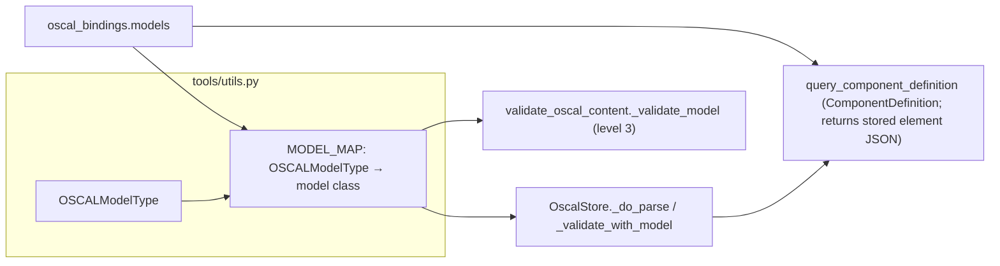

# Design Document: Replace compliance-trestle with oscal-bindings

## Overview

This is a library swap. `compliance-trestle` is removed and `oscal-bindings==0.1.0` supplies the OSCAL Pydantic models. Three modules touch model classes today (`oscal_store.py`, `validate_oscal_content.py`, `query_component_definition.py`), and two of them carry duplicate `(module path, class name)` maps resolved through `importlib`. The design collapses both maps into one `MODEL_MAP` of class objects in `tools/utils.py`, renames library-specific identifiers, and fixes the Component Definition tools at the source so they return the stored OSCAL JSON of each element (Trestle's `oscal_dict()` is removed along with the library).

Accepted client-visible changes (from requirements): validation level 3 is named `"model"` instead of `"trestle"`; parsed datetimes keep their original UTC offset; and `get_capability` and component query results switch to OSCAL (hyphenated) keys with nulls omitted.

The upstream issue cairn-proofs/oscal-bindings-python#5 is tracked separately and is not a dependency of this work.

Because "same behavior as before" cannot be asserted once Trestle is gone, the plan includes a one-time differential check run while both libraries are installed (see [Migration and verification plan](#migration-and-verification-plan)). Permanent tests use library-independent oracles instead.

## Architecture



Before: store and validator each held a string map and imported the module at call time. After: a single map of class objects, imported once at module load.

### Import cost and cycles

`tools/utils.py` will import `oscal_bindings.models` at module import. Measured cost is about 0.16 s, paid once at server startup; `utils` is already imported on every startup path, so there is no extra cold path. `oscal_bindings` does not import `mcp_server_for_oscal`, so no cycle is possible. A lazy import was rejected: Requirement 2.3 asks for class objects, and eager imports give mypy real types.

## Components and Interfaces

### 1. `tools/utils.py` — `MODEL_MAP`

```python
from typing import Final

from oscal_bindings.models import (
    AssessmentPlan,
    AssessmentResults,
    Catalog,
    ComponentDefinition,
    MappingCollection,
    PlanOfActionAndMilestones,
    Profile,
    SystemSecurityPlan,
)
from pydantic import BaseModel

# Single source of OSCAL model classes, shared by OscalStore and the validator.
MODEL_MAP: Final[dict[OSCALModelType, type[BaseModel]]] = {
    OSCALModelType.CATALOG: Catalog,
    OSCALModelType.PROFILE: Profile,
    OSCALModelType.COMPONENT_DEFINITION: ComponentDefinition,
    OSCALModelType.SYSTEM_SECURITY_PLAN: SystemSecurityPlan,
    OSCALModelType.ASSESSMENT_PLAN: AssessmentPlan,
    OSCALModelType.ASSESSMENT_RESULTS: AssessmentResults,
    OSCALModelType.PLAN_OF_ACTION_AND_MILESTONES: PlanOfActionAndMilestones,
    OSCALModelType.MAPPING: MappingCollection,
}
```

- Defined directly below `OSCALModelType` (Req 2.1).
- A plain `dict` (not `MappingProxyType`) so tests can use `unittest.mock.patch.dict`.
- Value type: if `oscal_bindings` exports a common base class, use it instead of `pydantic.BaseModel`. Otherwise `pydantic.BaseModel` is fine; pydantic is already a transitive dependency through `mcp` and `oscal-bindings`.

### 2. `tools/oscal_store.py`

| Item | Change |
|---|---|
| `import importlib` | Removed |
| `TRESTLE_MODEL_MAP` | Removed; import `MODEL_MAP` from `tools.utils` (Req 2.4, 2.6) |
| `_do_parse` | Look up `MODEL_MAP`, then `model_class.model_validate(root_data)` (Req 3.1) |
| `_validate_with_trestle` | Renamed `_validate_with_model`, same signature; 3 call sites updated (Req 5.1) |
| `_build_cached_parse`, `get_parsed_model*`, `_ensure_indexed` | Logic unchanged; docstrings say "parsed OSCAL model" (Req 5.2, 7.4, 7.5) |
| `cache_size` docstring, section comments, log text | Library-neutral wording (Req 5.3) |
| `_child_dict` | Keeps explicit `model_dump_json(exclude_none=True, by_alias=True)` so stored child JSON uses OSCAL keys and omits nulls (Req 6.9) |

```python
@staticmethod
def _do_parse(raw_json: str, model_type_str: str) -> object:
    """Parse *raw_json* into the parsed OSCAL model for *model_type_str*."""
    try:
        model_type = OSCALModelType(model_type_str)
    except ValueError as exc:
        raise ValueError(f"Unknown model type '{model_type_str}'") from exc

    model_class = MODEL_MAP.get(model_type)
    if model_class is None:
        raise ValueError(f"No OSCAL model class for type '{model_type_str}'")

    data = json.loads(raw_json)
    root_data = data.get(model_type.value, data)
    try:
        return model_class.model_validate(root_data)
    except Exception as exc:
        raise RuntimeError(
            f"Failed to parse document as {model_class.__name__}: {exc}"
        ) from exc


def _validate_with_model(self, data: dict, model_type: OSCALModelType) -> bool:
    """Validate document data with the OSCAL model class for *model_type*."""
    model_class = MODEL_MAP.get(model_type)
    if model_class is None:
        logger.warning("No OSCAL model class for %s document", model_type.value)
        return False
    try:
        model_class.model_validate(data.get(model_type.value, data))
    except Exception as exc:
        logger.warning("OSCAL model validation failed for %s document: %s", model_type.value, exc)
        return False
    return True
```

The `RuntimeError("Cannot load ... model")` import-failure path goes away because nothing is loaded at call time.

The missing-mapping branch now rejects instead of accepting. This is a deliberate fail-closed change on a branch that cannot be reached: `MODEL_MAP` covers every `OSCALModelType` member, and a test enforces that. The old "accept without validation" comment was already stale, since mapping-collection was mapped. Req 7.3 is unaffected because no real input reaches the branch.

#### Child-element extraction audit

`_extract_child_elements` and `_extract_controls_from_groups` read attributes through `getattr(..., name)` and convert values with `str(...)`. Field names are confirmed identical only for the cdef classes. For the other seven models, two risks need checking:

1. **Attribute name drift.** For example `poam_items`, `control_implementation`, `system_implementation.components`, `local_definitions.activities`, `results[].findings`, `mappings`, `imports[].href`. A renamed attribute silently yields `None`, which means zero children and no error.
2. **Value type drift.** `str()` on a `RootModel` wrapper gives `"root='...'"`. `str()` on `AnyUrl` can normalize the URL (for example by adding a trailing slash). Either one changes stored titles and IDs.

The differential check below compares extracted child rows across both libraries for every bundled document, which catches both kinds of drift. If drift shows up, fix the attribute path or the conversion in the extractor. No compatibility shim is needed.

### 3. `tools/validate_oscal_content.py`

| Item | Change |
|---|---|
| `import importlib`, `_TRESTLE_MODEL_MAP` | Removed; import `MODEL_MAP` from `tools.utils` (Req 2.5, 2.6) |
| `_validate_trestle` | Renamed `_validate_model` (Req 4.4) |
| Level name | `"model"` everywhere (Req 4.1, 4.2) |
| Three skip loops `("json_schema", "trestle", "oscal_cli")` | Replaced by one module constant `_POST_PARSE_LEVELS = ("json_schema", "model", "oscal_cli")` so the name lives in one place |
| Docstrings of `validate_oscal_content` / `validate_oscal_file` | Level 3 line becomes `3. Model - Semantic checks via OSCAL Pydantic models` (Req 4.3) |
| Pipeline comment | `# -- Level 3: Model --` |

```python
def _validate_model(data: dict, model_type: OSCALModelType) -> dict:
    """Level 3: Semantic validation using OSCAL Pydantic models."""
    try:
        model_cls = MODEL_MAP[model_type]
    except KeyError as exc:
        return _make_level(
            "model",
            valid=False,
            errors=[f"Failed to load OSCAL model class for '{model_type}': {exc}"],
        )

    inner = data.get(model_type.value, data)
    try:
        model_cls.model_validate(inner)
    except Exception as exc:
        error_lines = str(exc).split("\n")
        warnings = []
        if len(error_lines) > MAX_ERRORS_PER_LEVEL:
            warnings.append(f"Showing {MAX_ERRORS_PER_LEVEL} of {len(error_lines)} error lines")
        return _make_level(
            "model", valid=False, errors=error_lines[:MAX_ERRORS_PER_LEVEL], warnings=warnings
        )

    return _make_level("model")
```

Notes:
- Calling `model_cls(**inner)` becomes `model_cls.model_validate(inner)` (Req 3.2). For a non-dict `inner`, the old call raised `TypeError` and the new one raises `ValidationError`. Both are caught and both reject, so accept/reject is preserved (Req 7.2).
- The old "unsupported model type → skipped" branch becomes the `KeyError` error path (Req 4.5). Like the store branch, it is unreachable for real input, and it keeps the `"Failed to load OSCAL model class"` message testable.
- Error text keeps Pydantic v2's `ValidationError` format, as before. Only the class names inside it may differ.

### 4. `tools/query_component_definition.py`

The cdef tools are fixed to return each element's stored OSCAL JSON instead of re-serializing parsed models (Req 6.1–6.11). Today `_materialize_components` returns `model_dump(exclude_none=True)` (snake_case) and `_get_capability` returns `model_dump()` (snake_case plus nulls); both are wrong for an OSCAL tool.

- **Imports:** only `ComponentDefinition` is still needed (the `isinstance` check in the `_raw` fallback): `from oscal_bindings.models import ComponentDefinition`. `Capability` and `DefinedComponent` are dropped if no longer referenced.
- **`_find_capability(store, scope, query_type, value) -> dict | None`:** call `_iter_children(..., include_raw_json=True)`, take the first hit, and return `_raw(store, hit)`. Return `None` if there is no hit or `_raw` returns `{}`.

  ```python
  def _find_capability(store, scope, query_type, value) -> dict | None:
      # Same element_id/title selection from query_type/value as today.
      rows = _iter_children(store, "capability", scope, ..., include_raw_json=True)
      hit = next(rows, None)
      if hit is None:
          return None
      return _raw(store, hit) or None
  ```
- **Capability response:** `"capability": cap` and `"component_count": len(cap.get("incorporates-components", []))`.
- **`_materialize_components(store, page)`:** `return [d for c in page if (d := _raw(store, c))]`. Candidates from `_select_component_candidates` already carry `raw_json`. Empty results are skipped; `_raw` already logs the warning.
- **`_get_capability(store, uuid)`:** returns the `_find_capability(...)` dict directly. The docstring text about compatibility with the original tool is removed.
- **`_raw` fallback:** keeps explicit `model_dump_json(exclude_none=True, by_alias=True)` when `raw_json` is missing (Req 6.10).

Benefit: the hot path no longer re-parses parent Component Definitions per request. The LRU parse cache still serves the `_raw` fallback.

### 5. `main.py` and `oscal_agent.py` logging

Remove `logging.getLogger("trestle").setLevel(config.log_level)` at all three sites (`main.py` ×2, `oscal_agent.py` ×1) (Req 5.4).

Req 5.5 is conditional. During evaluation, the `oscal_bindings` 0.1.0 runtime (`parser.py`, `extensions/*`) showed no logging calls. Once the dependency is installed, verify with:

```bash
grep -rnE "getLogger|logging\.(debug|info|warning|error|exception)" "$(hatch env find default)"/lib/python3.12/site-packages/oscal_bindings
```

The `lib/python3.12/site-packages` path matches hatch's virtual envs on this machine (default env is Python 3.12); on other layouts, locate the package with `hatch run python -c "import oscal_bindings, os; print(os.path.dirname(oscal_bindings.__file__))"`. Record the outcome in `tasks.md`. If the grep finds a named logger, add `logging.getLogger("oscal_bindings").setLevel(config.log_level)` at the three former sites. If it finds nothing, the branch does not apply.

### 6. Dependencies

- `pyproject.toml`: remove `compliance-trestle>=5.1.0` and add `oscal-bindings==0.1.0` (Req 1.1, 1.2). An exact pin is used because the models must match the bundled schema release.
- Run `hatch run update` to re-lock `requirements.txt` (Req 1.3). Trestle's transitive dependencies should drop out; check the diff for anything else that was only pulled in by Trestle and is imported directly by our code.

## Data Models

There are no schema or storage changes. The SQLite tables, the FTS layout, and `raw_json` contents (the original document text) are unchanged.

One stored value changes. Child-element `raw_json` written at index time comes from `model_dump_json`, so its datetime fields now keep the source offset instead of Trestle's UTC-normalized form (Req 8.1). Run `hatch run build-db` after the swap so any pre-built bundled DB matches the new serialization. `build-db` already runs in `hatch run release`.

Datetime behavior:

| Input | Trestle (before) | Bindings (after) |
|---|---|---|
| `2024-01-01T10:00:00-05:00` | normalized to UTC (`15:00:00+00:00`) | `10:00:00-05:00`, `utcoffset() == -5h` |

## Error Handling

| Site | Condition | Before | After |
|---|---|---|---|
| `OscalStore._do_parse` | unknown type string | `ValueError("Unknown model type ...")` | unchanged |
| `OscalStore._do_parse` | type not in map | `ValueError("No Trestle model mapping ...")` | `ValueError("No OSCAL model class for type ...")` |
| `OscalStore._do_parse` | class import failure | `RuntimeError("Cannot load Trestle model ...")` | removed (no runtime import) |
| `OscalStore._do_parse` | validation failure | `RuntimeError("Failed to parse document as <Class>: ...")` | unchanged |
| `OscalStore._validate_with_model` | type not in map | accept (unreachable) | reject + warning (unreachable; fail-closed) |
| `OscalStore._validate_with_model` | validation failure | `False` + "Trestle validation failed" warning | `False` + "OSCAL model validation failed" warning |
| `_validate_model` | type not in map | level skipped | level invalid, `"Failed to load OSCAL model class for '<type>': ..."` |
| `_validate_model` | validation failure | level `"trestle"` invalid, ≤20 error lines | level `"model"` invalid, ≤20 error lines |
| `_find_capability` | no hit, or `_raw` returns `{}` | `None` | `None` (now returns stored OSCAL dict, not a model) |
| `_materialize_components` | child JSON missing | skipped | skipped; warning from `_raw` |

## Correctness Properties

*A property is a characteristic or behavior that should hold true across all valid executions of a system-essentially, a formal statement about what the system should do. Properties serve as the bridge between human-readable specifications and machine-verifiable correctness guarantees.*

Reflection on properties: the separate prework properties for "valid documents accepted" (7.1), "invalid documents rejected" (7.2), "store accept/reject" (7.3), and "store/validator share the map" (2.4, 2.5, 3.2) are combined into Property 2. One generator of valid-or-mutated documents checks all of them against a single oracle. Property 4 also covers the skipped-level case (4.2) because its generator includes unparseable and undetectable inputs.

### Property 1: Typed parse returns the mapped class

For any `OSCALModelType` with a valid-document generator (the builders in `_VALID_DOC_BUILDERS` in `tests/tools/test_oscal_store.py`: catalog, component-definition, plan-of-action-and-milestones; keyed by root-key string) and any valid document of that type, `OscalStore._do_parse(json.dumps(doc), model_type.value)` returns an object whose type is exactly `MODEL_MAP[model_type]`.

**Validates: Requirements 3.1, 2.4**

### Property 2: Store and validator agree with the acceptance oracle

For any document `d` built by taking a generated valid OSCAL document and optionally applying one mutation (add an unknown key to the root object, add an unknown key to `metadata`, or delete a required key such as `uuid` or `metadata`), `OscalStore._validate_with_model(d, t)` and `_validate_model(d, t)["valid"]` are equal, and both are `True` exactly when no mutation was applied.

**Validates: Requirements 7.1, 7.2, 7.3, 3.2, 2.5**

### Property 3: Cdef tool output is the source element's OSCAL JSON

For any generated set of Component Definitions (the existing `test_properties.py` strategy) and any capability or component in it, the capability query result, the component query result, and the `get_capability` result each equal that element's source JSON dict (datetime-equivalent), contain no null values and no snake_case keys, and pass level-2 JSON Schema validation when embedded in a minimal component-definition document. The source dict is a library-independent oracle.

**Validates: Requirements 6.2, 6.3, 6.4, 6.5, 6.7, 6.11, 6.12, 6.13, 6.14, 6.15**

### Property 4: Level names are stable

For any input string (generated valid OSCAL JSON, mutated OSCAL JSON, JSON objects with arbitrary root keys, non-object JSON, and non-JSON text), the `levels` list returned by `validate_oscal_content` has names `["well_formedness", "json_schema", "model", "oscal_cli"]` in that order, whether level 3 runs or is skipped.

**Validates: Requirements 4.1, 4.2, 10.2**

### Property 5: Datetime offsets are preserved

For any UTC offset permitted by the OSCAL DateTimeWithTimezoneDatatype pattern, and any naive timestamp, a Component Definition whose `metadata.last-modified` carries that offset parses (via `OscalStore._do_parse`) to a model where `metadata.last_modified.utcoffset()` equals the input offset.

**Validates: Requirements 8.1**

## Testing Strategy

Property tests use Hypothesis with `@settings(max_examples=100)` or more, and each carries the tag comment `# Feature: oscal-bindings migration (#26), Property N: <title>`. The tag deliberately avoids the spec directory name, which contains "trestle" and would violate Req 10.4. Reuse existing strategies (`test_properties.py` cdef strategy, `test_nested_catalog_controls_bug.py` catalog strategy, `test_oscal_store.py` `_VALID_DOC_BUILDERS`) instead of writing new ones. Put properties 1, 2, and 5 in `tests/tools/test_oscal_store.py` or a new `tests/test_oscal_models.py`, property 3 in `tests/test_properties.py`, and property 4 in `tests/tools/test_validate_oscal_content.py`.

### Example tests (new or rewritten)

- **`MODEL_MAP` completeness (Req 2.1–2.3):** `set(MODEL_MAP) == set(OSCALModelType)`; each value `is` the expected `oscal_bindings.models` class.
- **Schema version guard (Req 9.1):** add `test_matches_oscal_bindings_schema_version` to `TestBundledOscalVersion` in `tests/test_utils.py`, asserting `oscal_bindings.__oscal_schema_version__ == get_bundled_oscal_version()`.
- **`about` unchanged (Req 9.2):** the existing about-tool test continues to pass. Add an assertion that the key set has no bindings-version field.
- **`TestValidateModel`** (replaces `TestValidateTrestle`; Req 2.5, 4.4, 4.5). The `importlib` patches go away:
  - valid: `patch.dict(MODEL_MAP, {OSCALModelType.CATALOG: mock_cls})`, where `mock_cls.model_validate` returns normally, gives `valid is True` and `level == "model"`;
  - parse error: `mock_cls.model_validate.side_effect = Exception("a\nb\nc")` gives `valid is False` and the errors are split into lines;
  - load failure: `patch.dict(MODEL_MAP, {}, clear=True)` gives `errors[0].startswith("Failed to load OSCAL model class")`;
  - the mapping-collection test is kept unchanged except for the function name.
- **Pipeline tests:** patch targets change to `..._validate_model` and mocked return values use `"level": "model"`.
- **Cdef tool tests:** update tests in `test_query_component_definition.py` and `test_properties.py` that expect snake_case / `model_dump` output so they expect the source OSCAL dicts.
- **`component_count`:** example tests for a capability with `incorporates-components` and one without (count 0).
- **`_raw` fallback:** with `raw_json` set to `None`, the result has hyphenated keys and no nulls (Req 6.10).
- **Required examples for Req 6.12–6.15:** capability and component results embedded in a minimal component-definition pass level-2 schema validation; results contain no nulls; results contain no snake_case keys.
- **Imports:** every `from trestle.oscal.<x> import Y` in tests becomes `from oscal_bindings.models import Y` (Req 10.1).
- **Docstrings:** "Trestle-valid" becomes "model-valid", and in `test_nested_catalog_controls_bug.py`, `Group2`/`Group1` become `CatalogGroupWithControls`/`CatalogGroupWithGroups` (Req 10.3).
- **Existing LRU-cache and lazy-indexing tests** stay unchanged and must pass (Req 7.4, 7.5).

### Finding UTC-normalization expectations (Req 8.2)

1. Run `hatch test` after the swap. Datetime-related failures point to assertions that depended on normalization.
2. Grep the tests for `+00:00`, `timezone.utc`, `astimezone`, `utcoffset`, `tzinfo`, and `Z"`. At design time, `+00:00` appears only in input fixtures (`test_properties.py`, `fixture_store.py`, `test_query_component_definition.py`), and those are inputs, not normalization assertions. Any expectation found is changed to expect the source offset.

## Migration and Verification Plan

### Step 0: Differential check (temporary, both libraries installed)

Add `oscal-bindings==0.1.0` while keeping `compliance-trestle`, then run `hatch run update`. Write a throwaway script at `private/trestle_diff.py`; `private/` is gitignored, so the script is never committed. Run it with `hatch run python private/trestle_diff.py`. It covers every document in the bundled DB (`raw_json`, `model_type`), `tests/fixtures/*.json`, and the JSON and zip members under `data/`, and for each one compares:

1. accept/reject under the Trestle class versus the Bindings class (Req 7.1–7.3);
2. `OscalStore._extract_child_elements(model_type, parsed_model)` output (`uuid`, `title`, `element_type`, `description`) for each parsed model (the extraction audit). It is an instance method that only reads its arguments, so one throwaway `OscalStore` instance can be reused for both libraries' parsed models;
3. for every child element, the Stored_Element_JSON produced by each library equals the element's JSON in the source document (datetime-equivalent).

Datetime-only differences in child `raw_json` are expected; normalize them before comparing. Summarize the outcome (counts and any differences, with how each was fixed) in `tasks.md`, then delete the script. Any non-datetime difference blocks the swap until it is fixed in the extractor or explicitly accepted by the user.

### Step 1: Swap

Make the code changes in components 1–5, remove `compliance-trestle`, run `hatch run update`, and run the logging grep for Req 5.5. Then run `hatch run build-db`, `hatch check fmt --fix`, `hatch check code --fix`, and `hatch run tests`.

### Step 2: Verification greps (no permanent test)

```bash
grep -rIil trestle src bin tests pyproject.toml requirements.txt   # Req 1.2–1.4, 2.6, 5.4, 10.4: expect no output
grep -rnE "importlib|parse_oscal|from oscal_bindings import parse" src/mcp_server_for_oscal/tools/oscal_store.py src/mcp_server_for_oscal/tools/validate_oscal_content.py   # Req 2.3, 3.3
grep -rnE "parse_oscal|from oscal_bindings import parse" src bin tests   # Req 3.3: expect no output
grep -rnE "Group1|Group2" tests                                     # Req 10.3
grep -rnE "oscal_dict|_wrap_capability" src tests                   # Req 6.6: expect no output
git diff --stat main -- .kiro/specs ':!.kiro/specs/replace-trestle-with-oscal-bindings'   # Req 11.6: expect empty
```

`-I` skips binaries such as stale `__pycache__` files and the gitignored `oscal_store.db`. A grep step is used instead of a permanent string test: the check runs once at migration time, and a permanent test would have to exclude itself from its own search.

## Documentation and Steering

| File | Change |
|---|---|
| `.kiro/steering/compliance-trestle.md` | `git mv` to `.kiro/steering/oscal-bindings.md` and rewrite (Req 11.1, 11.2): use `oscal_bindings.models` typed classes with `Model.model_validate(root_data)`; never use `parse_oscal()` or other union `parse_*` helpers; get classes from `MODEL_MAP` in `tools/utils.py`; models are strict (extra forbidden); datetimes keep their offset; serialize with `model_dump(_json)(by_alias=True, exclude_none=True)`; keep `oscal_bindings.__oscal_schema_version__` in step with the bundled schemas (the guard test enforces this) |
| `AGENTS.md` | Rules table points to `oscal-bindings.md`; remove the "model map is duplicated" gotcha; describe `MODEL_MAP` in `tools/utils.py` as the single source of model classes; validation levels read "JSON → JSON Schema → model → oscal-cli"; when bumping the schema version, also bump `oscal-bindings` (Req 11.3–11.5) |
| `src/mcp_server_for_oscal/tools/README.md` | Level 3 named `"model"`; `MODEL_MAP` as the single source (Req 4.6, 11.5). This file is under `src/`, so Req 10.4 applies: no mention of Trestle at all, not even historical |
| `.kiro/steering/tech.md`, `.agents/summary/*`, `conf/powers/oscal/POWER.md`, `README.md`, `CONTRIBUTING.md` | Replace Trestle with oscal-bindings as the model library (Req 11.3) |
| `.kiro/steering/hatch.md`, `.kiro/steering/product.md` | Both name Trestle (the one-off snippet example and the validator line); remove those references (Req 11.3) |
| Historical specs under `.kiro/specs/` | Untouched (Req 11.6) |
